---
vault:
categories:
subCategories:
topics:
subTopics:
dateCreated: 2025-08-14
dateRevised: 2025-08-16
aliases: []
tags: []
---

# agent-orchestration-model

## Overview

Ultra-efficient multi-agent system leveraging Claude Zen MCP, Claude Code, and SuperClaude for rapid execution (12-16 hours vs 12 weeks).

---

## Accelerated Agent Architecture

```mermaid
graph TB
    User[User Request] --> SuperClaude[🚀 SuperClaude Orchestrator]
    
    SuperClaude --> Wave{Wave Orchestration}
    
    %% MCP-Enhanced Agents
    Wave --> Foundation[⚡ Foundation Agent<br/>zen:codegen + Task]
    Wave --> Integration[🔧 Integration Agent<br/>zen:debug + Sequential]
    Wave --> Publishing[🌐 Publishing Agent<br/>zen:deploy + Magic]
    Wave --> Enhancement[✨ Enhancement Agent<br/>zen:refactor + testgen]
    Wave --> Optimization[📈 Optimization Agent<br/>zen:analyze + secaudit]
    
    %% Parallel Execution
    Foundation -.->|parallel| Theme[Theme Gen<br/>gemini-2.5-pro]
    Foundation -.->|parallel| Templates[Template Gen<br/>o3]
    Foundation -.->|parallel| Plugins[Plugin Config<br/>MultiEdit]
    
    Integration -.->|parallel| Quartz[Quartz Setup<br/>Bash + codegen]
    Integration -.->|parallel| Pipeline[Content Pipeline<br/>planner]
    
    Publishing -.->|parallel| Domain[Domain/SSL<br/>deploy]
    Publishing -.->|parallel| CICD[GitHub Actions<br/>codegen]
    
    %% Outcomes in Hours
    Theme & Templates & Plugins --> Hour2[✓ 2 hours]
    Quartz & Pipeline --> Hour5[✓ 5 hours]
    Domain & CICD --> Hour7[✓ 7 hours]
    Enhancement --> Hour10[✓ 10 hours]
    Optimization --> Hour12[✓ 12 hours]
    
    style SuperClaude fill:#FF6B6B,stroke:#C92A2A,stroke-width:3px,color:#fff
    style Hour7 fill:#51CF66,stroke:#2F9E44,stroke-width:2px
    style Hour12 fill:#51CF66,stroke:#2F9E44,stroke-width:2px
```



---

## MCP-Enhanced Agent Definitions

### 🚀 SuperClaude Orchestrator

**Role**: Hyper-efficient task routing with wave orchestration

```yaml
Tools:
  - zen:planner (wave orchestration)
  - zen:consensus (multi-model validation)
  - Task (parallel delegation)
Commands:
  - --wave-mode force
  - --delegate auto
  - --parallel-execution
  - --uc (ultra-compressed)
Models:
  Primary: o3
  Fallback: gemini-2.5-pro
  Critical: o3-pro
```

### ⚡ Foundation Agent (Phase 1: 2 hours)

**Tools & Commands**:

```bash
# Parallel execution streams
Stream1: zen:codegen --obsidian-theme --css-variables 400
Stream2: zen:testgen --templates daily,meeting,project,blog  
Stream3: MultiEdit --configure-plugins dataview,templater
```

**Models**: gemini-2.5-pro (generation), o3 (complex logic)
**Output**: Complete Obsidian environment in 2 hours

### 🔧 Integration Agent (Phase 2: 3 hours)

**Tools & Commands**:

```bash
Primary: zen:planner --content-pipeline
Secondary: zen:debug --test-quartz-build
Validation: zen:precommit --validate-integration
```

**Models**: o3 (planning), grok-3 (validation)
**Output**: Fully integrated Quartz v4 in 3 hours

### 🌐 Publishing Agent (Phase 3: 2 hours)

**Tools & Commands**:

```bash
Infrastructure: zen:deploy --setup-domain --ssl --cdn
Automation: zen:codegen --github-actions
Verification: zen:analyze --verify-deployment
```

**Models**: o3 (deployment), gemini-2.5-pro (config generation)
**Output**: Live site at vibecoding.gold in 2 hours

### ✨ Enhancement Agent (Phase 4: 3 hours)

**Tools & Commands**:

```bash
Search: Magic --search-component --full-text
Navigation: Sequential --navigation-features
Templates: zen:refactor --refine-templates
```

**Models**: gemini-2.5-pro (UI), o3 (logic)
**Output**: Enhanced features in 3 hours

### 📈 Optimization Agent (Phase 5: 2 hours)

**Tools & Commands**:

```bash
Performance: zen:analyze --performance-optimization
Security: zen:secaudit --final-audit
Monitoring: zen:deploy --monitoring-setup
```

**Models**: o3 (analysis), gemini-2.5-pro (implementation)
**Output**: Optimized platform in 2 hours

---

## Execution Protocol

### Rapid Fire Sequence

```yaml
Hour 0-0.5: Validation
  Tools: [thinkdeep, consensus]
  Parallel: true
  
Hour 0.5-2.5: Foundation
  Tools: [codegen, testgen, MultiEdit]
  Parallel: true
  Streams: 3
  
Hour 2.5-5.5: Integration
  Tools: [planner, debug, precommit]
  Parallel: true
  Streams: 2
  
Hour 5.5-7.5: Publishing
  Tools: [deploy, codegen, analyze]
  Parallel: true
  Streams: 2
  
Hour 7.5-10.5: Enhancement
  Tools: [Magic, Sequential, refactor]
  Parallel: false  # Sequential for quality
  
Hour 10.5-12.5: Optimization
  Tools: [analyze, secaudit, deploy]
  Parallel: true
  Streams: 2
```

### Token Efficiency Matrix

| Agent | Token Budget | Compression | Model | Priority |
|-------|-------------|-------------|--------|----------|
| Orchestrator | 50K | --uc always | o3 | Critical |
| Foundation | 75K | --uc optional | gemini-2.5-pro | High |
| Integration | 125K | --uc optional | o3/grok-3 | Critical |
| Publishing | 100K | --uc always | o3 | Critical |
| Enhancement | 100K | Standard | gemini-2.5-pro | Medium |
| Optimization | 50K | --uc always | o3 | High |

### Parallel Execution Map


---

## Critical Success Factors

### Speed Optimizations

1. **Wave Mode**: Always use `--wave-mode force` for complex operations
2. **Delegation**: Use `--delegate auto` for parallel processing
3. **Model Selection**: Use fastest appropriate model
4. **Compression**: Apply `--uc` for all non-critical output
5. **Caching**: Enable for repeated operations

### Quality Gates (Automated)

```bash
# After each phase
zen:consensus --quick-validation \
  --models "gemini-2.5-flash,o4-mini" \
  --phase-complete $PHASE_NUMBER
```

### Failure Recovery

```yaml
Agent Timeout:
  Action: Switch to faster model
  Fallback: Manual intervention
  
Build Failure:
  Action: zen:debug --auto-fix
  Fallback: Simpler approach
  
Deploy Failure:
  Action: Retry with Docker
  Fallback: Alternative platform
```

---

## Command Shortcuts

### One-Command Execution

```bash
# Complete project in one command
zen:planner --model o3-pro \
  --project "Vibe Coding Gold" \
  --wave-mode enterprise \
  --phases all \
  --parallel-execution \
  --auto-validate \
  --deploy-on-success \
  --time-limit 12h
```

### Phase-Specific Commands

```bash
# Foundation only (2 hours)
Task --delegate all --phase foundation --complete

# Core MVP (7.5 hours)
zen:planner --mvp --phases "foundation,integration,publishing"

# Full platform (12.5 hours)
zen:planner --complete --all-phases --optimize
```

---

## Monitoring & Telemetry

### Real-Time Progress

```bash
# Monitor execution
zen:analyze --monitor-execution \
  --show-progress \
  --estimate-completion \
  --alert-on-block
```

### Performance Metrics

- Token usage per agent
- Execution time per phase
- Success rate per operation
- Quality score per deliverable

---

## Final Deliverables Timeline

| Hour | Deliverable | Status Check |
|------|------------|--------------|
| 0.5 | Validation complete | ✓ Node.js v22 verified |
| 2.5 | Obsidian ready | ✓ Theme + templates |
| 5.5 | Quartz integrated | ✓ Build successful |
| 7.5 | Site live | ✓ vibecoding.gold accessible |
| 10.5 | Features complete | ✓ Search + navigation |
| 12.5 | Fully optimized | ✓ <3s load time |

---

## Post-Execution

```bash
# Generate complete documentation
zen:docgen --complete-package \
  --architecture --guides --api \
  --handover --maintenance
```
