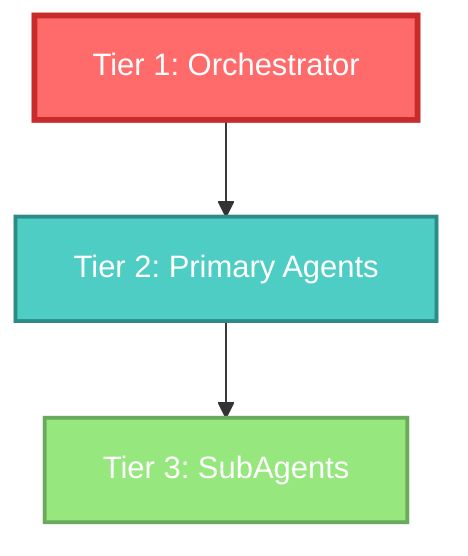
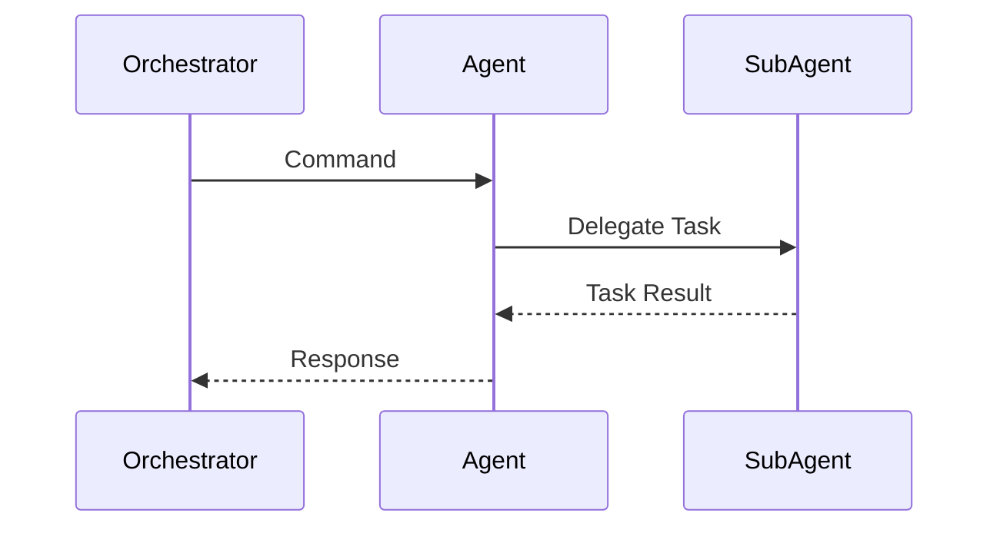
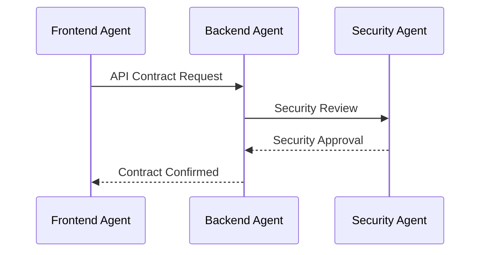
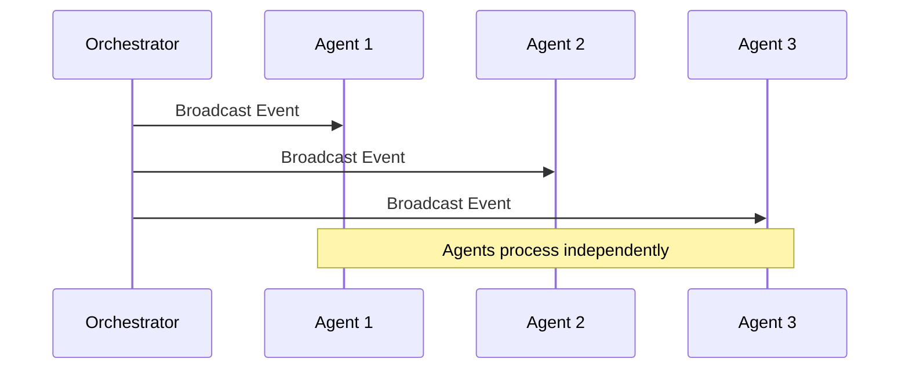

---
vault:
categories:
subCategories:
topics:
subTopics:
dateCreated: 2025-08-16
dateRevised: 2025-08-16
aliases: []
tags: []
---

# agents-and-sub-agents

This document defines the hierarchical structure, relationships, and communication protocols between agents and sub-agents in the multi-agent development system.

## Hierarchical Structure

### Three-Tier Architecture



### Tier Definitions

#### Tier 1: Orchestrator Layer
- **Single Agent**: agentOrchestrator
- **Role**: Central command and control
- **Authority**: Can activate any agent, coordinate workflows, manage resources
- **Restrictions**: Cannot write code directly, must delegate

#### Tier 2: Primary Agent Layer
- **Count**: 20 primary agents
- **Role**: Domain expertise and task execution
- **Authority**: Can delegate to subAgents, coordinate with peers
- **Types**:
  - Core Agents (8): Essential development functions
  - Specialized Agents (12): Specific workflow tasks

#### Tier 3: SubAgent Layer
- **Count**: 25 subAgents
- **Role**: Specialized implementation and support
- **Authority**: Execute specific tasks within parent scope
- **Types**:
  - Language SubAgents (6): Code implementation
  - Domain SubAgents (19): Specialized support

## Agent Relationships

### Relationship Types

#### 1. Orchestration (One-to-Many)
```yaml
relationship: orchestration
direction: top-down
cardinality: 1:N
from: agentOrchestrator
to: [all primary agents]
protocol: command-response
authority: full
```

#### 2. Delegation (One-to-Many)
```yaml
relationship: delegation
direction: parent-to-child
cardinality: 1:N
from: [primary agent]
to: [subAgents]
protocol: task-result
authority: scoped
```

#### 3. Coordination (Peer-to-Peer)
```yaml
relationship: coordination
direction: bidirectional
cardinality: N:N
from: [primary agent]
to: [primary agent]
protocol: request-acknowledge
authority: none
```

### Relationship Matrix

| Agent Type | Can Orchestrate | Can Delegate To | Can Coordinate With |
|------------|-----------------|-----------------|---------------------|
| agentOrchestrator | All Agents | None | None |
| Core Agents | None | SubAgents | Other Agents |
| Specialized Agents | None | SubAgents | Other Agents |
| SubAgents | None | None | None |

## Communication Protocols

### 1. Command Protocol (Orchestrator → Agent)

```json
{
  "protocol": "command",
  "from": "agentOrchestrator",
  "to": "agentImplementation",
  "command": {
    "action": "implement_feature",
    "params": {
      "feature": "user_authentication",
      "language": "typescript",
      "framework": "express"
    },
    "priority": "high",
    "timeout": 3600
  },
  "correlation_id": "cmd_001",
  "timestamp": "2025-08-16T00:00:00Z"
}
```

### 2. Delegation Protocol (Agent → SubAgent)

```json
{
  "protocol": "delegation",
  "from": "agentBackend",
  "to": "subAgentNodeJS",
  "task": {
    "type": "write_code",
    "specification": {
      "file": "server.js",
      "function": "createAPIEndpoint",
      "requirements": ["REST", "authentication", "validation"]
    }
  },
  "context": {
    "project": "vibe-coding-gold",
    "module": "backend"
  },
  "delegation_id": "del_001"
}
```

### 3. Coordination Protocol (Agent ↔ Agent)

```json
{
  "protocol": "coordination",
  "from": "agentFrontend",
  "to": "agentBackend",
  "message": {
    "type": "api_contract",
    "action": "confirm_endpoint",
    "data": {
      "endpoint": "/api/users",
      "method": "POST",
      "payload": {"username": "string", "email": "string"}
    }
  },
  "requires_response": true,
  "coordination_id": "coord_001"
}
```

### 4. Response Protocol (All Directions)

```json
{
  "protocol": "response",
  "from": "agentImplementation",
  "to": "agentOrchestrator",
  "response": {
    "status": "success",
    "result": {
      "files_created": ["auth.ts", "auth.test.ts"],
      "lines_of_code": 250,
      "tests_passed": 12
    },
    "errors": [],
    "warnings": ["Consider adding rate limiting"]
  },
  "correlation_id": "cmd_001",
  "duration_ms": 1500
}
```

## Delegation Patterns

### Pattern 1: Direct Delegation
```
agentOrchestrator → agentBackend → subAgentNodeJS
```
- Most common pattern
- Clear chain of command
- Single responsibility

### Pattern 2: Multi-SubAgent Delegation
```
agentImplementation → {
  subAgentTypeScript (frontend),
  subAgentNodeJS (backend),
  subAgentPython (scripts)
}
```
- Parallel execution
- Coordinated implementation
- Cross-language features

### Pattern 3: Cascading Delegation
```
agentOrchestrator → agentWorkflow → agentEstimation
                  ↓
            agentImplementation → subAgentJavaScript
```
- Complex workflows
- Sequential dependencies
- Multi-stage processes

### Pattern 4: Shared SubAgent
```
agentBackend     ↘
agentFrontend    → subAgentTypeScript
agentImplementation ↗
```
- Resource sharing
- Consistent implementation
- Language expertise reuse

## Rules and Constraints

### Delegation Rules

1. **Single Parent Rule**: Each subAgent can only serve one parent at a time
2. **Scope Inheritance**: SubAgents inherit scope limitations from parent
3. **No Sub-Sub-Agents**: SubAgents cannot have their own subAgents
4. **Language Matching**: Language subAgents only accept tasks in their language
5. **Authority Boundary**: SubAgents cannot exceed parent's authority

### Communication Rules

1. **Orchestrator Priority**: Commands from orchestrator override all others
2. **Synchronous Delegation**: Parent waits for subAgent completion
3. **Async Coordination**: Peer coordination is non-blocking
4. **Timeout Enforcement**: All operations have maximum timeout
5. **Error Escalation**: Errors bubble up the hierarchy

### Conflict Resolution

```yaml
priority_order:
  1: User directive (via orchestrator)
  2: Orchestrator command
  3: Parent agent delegation
  4: Peer coordination request
  5: Cached/default behavior

conflict_resolution:
  same_priority: first_in_first_out
  resource_conflict: orchestrator_decides
  scope_conflict: narrow_scope_wins
  timeout_conflict: shorter_timeout_wins
```

## Agent Communication Patterns

### Request-Response Pattern


### Coordination Pattern


### Broadcast Pattern


## SubAgent Capabilities and Restrictions

### Language SubAgents

| SubAgent | Can Do | Cannot Do | Parent Agents |
|----------|--------|-----------|---------------|
| subAgentNodeJS | Write Node.js code, Create servers, Handle async | Frontend code, Database design | Backend, Implementation, Debug, Cleanup, Test |
| subAgentJavaScript | Write JS code, DOM manipulation, Events | Server code, System calls | Frontend, Backend, Implementation, Debug, Cleanup |
| subAgentTypeScript | Type-safe code, Interfaces, Generics | Runtime type checking, JS-only features | Frontend, Backend, Implementation, Debug, Cleanup |
| subAgentPython | Python scripts, Data processing, Automation | JavaScript code, Frontend | Backend, Implementation, Debug, Infrastructure |
| subAgentGo | System tools, Concurrent code, APIs | Frontend, Dynamic typing | Backend, Implementation, Debug, Infrastructure |
| subAgentGoogleAppsScript | Google Workspace automation, Triggers | General web development, Local file access | Backend, Frontend, Implementation |

### Domain SubAgents

| SubAgent | Specialization | Parent Agent | Key Responsibilities |
|----------|---------------|--------------|----------------------|
| subAgentDatabasePerformance | Query optimization | agentBackend | Indexes, query plans, connection pooling |
| subAgentAPIDesign | API architecture | agentBackend | REST/GraphQL design, versioning |
| subAgentMicroservices | Service architecture | agentBackend | Service mesh, communication patterns |
| subAgentAccessibility | WCAG compliance | agentFrontend | Screen readers, ARIA, keyboard nav |
| subAgentComponentDesign | UI architecture | agentFrontend | Component patterns, design systems |
| subAgentVulnerability | Security scanning | agentSecurity | CVE analysis, penetration testing |
| subAgentCompliance | Regulatory compliance | agentSecurity | GDPR, HIPAA, SOC2 |
| subAgentPerformanceTesting | Load testing | agentTest | Benchmarks, stress testing |
| subAgentUnitTest | Unit testing | agentTest | Test isolation, mocking |
| subAgentKubernetes | K8s orchestration | agentInfrastructure | Cluster management, deployments |

## Message Flow Examples

### Example 1: New Feature Implementation

```yaml
flow:
  1. User → agentOrchestrator: "Add user authentication"
  2. agentOrchestrator → agentDesign: "Design auth system"
  3. agentDesign → agentOrchestrator: "Design complete"
  4. agentOrchestrator → agentImplementation: "Implement auth"
  5. agentImplementation → subAgentTypeScript: "Write auth module"
  6. subAgentTypeScript → agentImplementation: "Code complete"
  7. agentImplementation → agentOrchestrator: "Feature implemented"
  8. agentOrchestrator → agentTest: "Test auth system"
  9. agentTest → subAgentUnitTest: "Create unit tests"
  10. subAgentUnitTest → agentTest: "Tests created"
  11. agentTest → agentOrchestrator: "All tests passing"
  12. agentOrchestrator → User: "Authentication feature complete"
```

### Example 2: Bug Fix Workflow

```yaml
flow:
  1. User → agentOrchestrator: "Fix login bug"
  2. agentOrchestrator → agentAnalyzer: "Investigate bug"
  3. agentAnalyzer → agentOrchestrator: "Root cause found"
  4. agentOrchestrator → agentDebug: "Fix identified issue"
  5. agentDebug → subAgentJavaScript: "Fix validation logic"
  6. subAgentJavaScript → agentDebug: "Fix applied"
  7. agentDebug → agentOrchestrator: "Bug fixed"
  8. agentOrchestrator → agentTest: "Verify fix"
  9. agentTest → agentOrchestrator: "Fix verified"
  10. agentOrchestrator → User: "Bug resolved"
```

## Performance Considerations

### Communication Overhead

```yaml
latency_targets:
  orchestration: < 100ms
  delegation: < 50ms
  coordination: < 200ms
  response: < 50ms

optimization_strategies:
  - Cache frequent communications
  - Batch similar requests
  - Use async where possible
  - Implement circuit breakers
  - Apply backpressure controls
```

### Concurrency Limits

```yaml
max_concurrent:
  orchestrator_commands: 10
  agent_delegations: 5
  subagent_tasks: 1
  coordination_messages: 20

queue_strategies:
  overflow: reject_with_retry
  priority: weighted_fair_queue
  timeout: exponential_backoff
```

## Error Handling

### Error Propagation

```yaml
error_flow:
  subagent_error:
    1. Log locally
    2. Report to parent agent
    3. Parent attempts recovery
    4. If failed, escalate to orchestrator
    5. Orchestrator decides action
    
  agent_error:
    1. Log locally
    2. Attempt self-recovery
    3. Report to orchestrator
    4. Orchestrator reassigns or fails task
    
  orchestrator_error:
    1. Log critically
    2. Attempt graceful degradation
    3. Notify user
    4. Enter safe mode
```

### Recovery Strategies

```yaml
recovery_patterns:
  retry_with_backoff:
    attempts: 3
    backoff: exponential
    max_delay: 30s
    
  fallback_agent:
    primary: agentImplementation
    fallback: agentBackend + agentFrontend
    
  model_downgrade:
    primary: o3-pro
    fallback: o3
    emergency: gemini-2.5-flash
    
  scope_reduction:
    full_feature: implement_complete_module
    reduced: implement_core_functionality
    minimum: implement_critical_path
```

## Monitoring and Metrics

### Communication Metrics

```yaml
metrics_tracked:
  - message_count_per_agent
  - average_response_time
  - error_rate_by_protocol
  - delegation_depth
  - coordination_frequency
  - timeout_occurrences
  - retry_attempts
  - success_rate_by_pattern
```

### Health Indicators

```yaml
health_checks:
  agent_responsive:
    timeout: 5s
    method: ping
    
  subagent_available:
    check: parent_can_delegate
    frequency: 60s
    
  communication_healthy:
    latency: < 1s
    error_rate: < 0.01
    throughput: > 10msg/s
```

## Best Practices

### For Orchestration
1. Clear, atomic commands
2. Include timeout and priority
3. Handle partial failures gracefully
4. Maintain command idempotency
5. Log all orchestration decisions

### For Delegation
1. Validate subAgent availability first
2. Provide complete context
3. Set realistic timeouts
4. Handle subAgent failures locally
5. Clean up resources on completion

### For Coordination
1. Use async patterns when possible
2. Implement coordination timeouts
3. Avoid circular dependencies
4. Document coordination contracts
5. Version coordination protocols

## Future Enhancements

- [ ] Implement agent hot-swapping
- [ ] Add dynamic subAgent creation
- [ ] Create agent communication visualization
- [ ] Implement distributed agent system
- [ ] Add machine learning for optimal routing
- [ ] Create agent performance profiling
- [ ] Implement agent versioning system
- [ ] Add communication encryption
- [ ] Create agent marketplace for new capabilities
- [ ] Implement agent federation for cross-system collaboration
