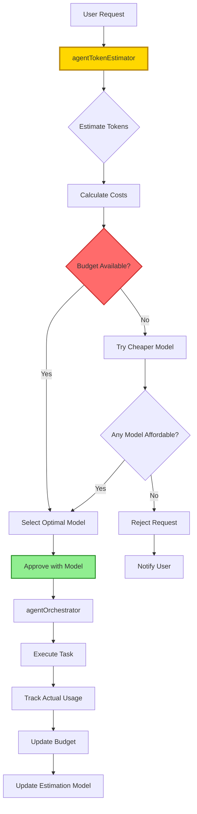

---
vault:
categories:
subCategories:
topics:
subTopics:
dateCreated: 2025-08-16
dateRevised: 2025-08-16
aliases: []
tags: []
---

# agents-budget

## Executive Summary

Total Monthly Budget: **$2,000**
Daily Budget Cap: **$66.67** (enforced at $100 hard stop)
Emergency Reserve: **$200** (10% of monthly)
Token Estimation Agent: **agentTokenEstimator** (NEW)

## Budget Architecture

### Monthly Budget Breakdown

```yaml
total_monthly_budget: $2000
effective_daily_budget: $66.67

primary_allocation:
  development: 40% ($800)
    agentImplementation: $300 (15%)
    agentBackend: $250 (12.5%)
    agentFrontend: $250 (12.5%)
    
  testing_security: 30% ($600)
    agentSecurity: $300 (15%)
    agentTest: $200 (10%)
    agentDebug: $100 (5%)
    
  orchestration: 20% ($400)
    agentOrchestrator: $300 (15%)
    agentTokenEstimator: $100 (5%) # NEW
    
  operations: 10% ($200)
    agentDocumentation: $50 (2.5%)
    agentPerformance: $50 (2.5%)
    agentCleanup: $50 (2.5%)
    emergency_reserve: $50 (2.5%)
```

### Token Estimation Agent (NEW)

```yaml
name: agentTokenEstimator
type: core
description: Token usage prediction and budget pre-approval specialist
memory_id: TOKEN-001
primary_model: gemini-2.5-flash  # Fast and cheap for estimation
fallback_models: [o4-mini, llama-3.2]
emergency_model: llama-3.2

responsibilities:
  - Pre-execution token estimation
  - Cost calculation before task execution
  - Budget availability verification
  - Model recommendation based on budget
  - Token optimization suggestions
  - Real-time budget tracking

activation:
  - AUTOMATIC: Before every agent activation
  - Intercepts all /sc: commands
  - Must approve before execution

decision_flow:
  1. Receive task from orchestrator
  2. Analyze task complexity
  3. Estimate token usage per model
  4. Calculate costs for each model option
  5. Check budget availability
  6. Recommend optimal model
  7. Approve/reject/modify request
  8. Track actual vs estimated
```

## Token Pricing Matrix

### Current Model Costs (January 2025)

| Model | Input (per 1M) | Output (per 1M) | Avg Combined | Context Window | Monthly Allocation |
|-------|----------------|-----------------|--------------|----------------|-------------------|
| **o3-pro** | $75 | $125 | $100 | 200K | $100 (emergency only) |
| **o3** | $40 | $60 | $50 | 200K | $400 |
| **claude-opus-4** | $60 | $90 | $75 | 200K | $200 |
| **claude-sonnet-4** | $30 | $50 | $40 | 200K | $150 |
| **grok-3** | $25 | $35 | $30 | 131K | $200 |
| **grok-3-fast** | $30 | $40 | $35 | 131K | $100 |
| **gemini-2.5-pro** | $15 | $25 | $20 | 1M | $400 |
| **gpt-4.1** | $20 | $30 | $25 | 1M | $100 |
| **o4-mini** | $8 | $12 | $10 | 200K | $150 |
| **gemini-2.5-flash** | $3 | $7 | $5 | 1M | $200 |
| **llama-3.2** | $0 | $0 | $0 | 128K | Unlimited |

### Token Usage Estimates by Task Type

| Task Type | Complexity | Input Tokens | Output Tokens | Total Tokens | Recommended Model |
|-----------|------------|--------------|---------------|--------------|-------------------|
| **Simple Query** | Low | 500-1K | 500-1K | 1-2K | gemini-2.5-flash |
| **Code Generation** | Medium | 2K-5K | 5K-10K | 7-15K | gemini-2.5-pro |
| **Feature Implementation** | High | 10K-20K | 20K-40K | 30-60K | o3 |
| **System Design** | High | 5K-10K | 10K-20K | 15-30K | claude-opus-4 |
| **Bug Analysis** | Medium | 15K-30K | 5K-10K | 20-40K | o3 |
| **Security Audit** | Critical | 20K-50K | 10K-20K | 30-70K | o3-pro |
| **Documentation** | Low | 5K-10K | 10K-20K | 15-30K | gemini-2.5-flash |
| **Refactoring** | Medium | 20K-40K | 20K-40K | 40-80K | gemini-2.5-pro |
| **Test Generation** | Medium | 10K-20K | 15K-30K | 25-50K | o3 |
| **Infrastructure** | High | 5K-10K | 10K-20K | 15-30K | o3 |

## Budget Control Mechanisms

### 1. Pre-Execution Controls

```yaml
token_estimation_required:
  all_tasks: true
  bypass_allowed: false
  
estimation_workflow:
  1_analyze:
    - Parse user request
    - Identify task type
    - Determine complexity
    
  2_estimate:
    - Calculate input tokens (context + prompt)
    - Estimate output tokens (based on task type)
    - Add 20% safety margin
    
  3_calculate:
    - Cost per model option
    - Time to complete per model
    - Quality expectations per model
    
  4_decide:
    approval_thresholds:
      auto_approve: < $0.10
      review_required: $0.10 - $1.00
      escalation_required: > $1.00
      
    rejection_triggers:
      - Daily budget exceeded
      - Task cost > 10% of remaining daily
      - Model unavailable
```

### 2. Real-Time Budget Tracking

```yaml
tracking_system:
  per_request:
    estimated_tokens: integer
    actual_tokens: integer
    estimated_cost: float
    actual_cost: float
    variance: percentage
    
  per_agent:
    daily_consumed: float
    daily_remaining: float
    monthly_consumed: float
    monthly_remaining: float
    
  system_wide:
    current_hour_spend: float
    current_day_spend: float
    current_week_spend: float
    current_month_spend: float
    burn_rate: float
    days_remaining_at_rate: integer
```

### 3. Progressive Budget Thresholds

```yaml
budget_thresholds:
  green_zone: 0-50%
    model_selection: optimal_quality
    approval: automatic
    
  yellow_zone: 50-75%
    model_selection: balanced
    approval: token_estimator_review
    
  orange_zone: 75-90%
    model_selection: economical
    approval: orchestrator_review
    downgrade: one_tier
    
  red_zone: 90-95%
    model_selection: minimal_cost
    approval: manual_required
    downgrade: two_tiers
    
  critical_zone: 95-100%
    model_selection: free_only
    approval: emergency_only
    action: switch_to_llama_3.2
```

### 4. Daily Budget Controls

```yaml
daily_controls:
  soft_limit: $66.67
  warning_threshold: $50.00
  hard_limit: $100.00
  
  hourly_distribution:
    business_hours: 70% # 9am-5pm
    evening_hours: 20%  # 5pm-9pm
    night_hours: 10%    # 9pm-9am
    
  spike_protection:
    max_per_hour: $20.00
    max_per_task: $5.00
    burst_limit: 3_consecutive_expensive_tasks
```

## Cost Optimization Strategies

### 1. Token Reduction Techniques

```yaml
context_optimization:
  code_minification:
    savings: 30-40%
    when: analyzing_code
    
  comment_stripping:
    savings: 20-30%
    when: not_documenting
    
  import_removal:
    savings: 10-15%
    when: not_relevant
    
  summary_substitution:
    savings: 60-70%
    when: context_over_50k
    
  selective_inclusion:
    savings: 40-50%
    when: targeted_analysis
```

### 2. Caching Strategy

```yaml
cache_system:
  response_cache:
    ttl: 24_hours
    savings: 40-50%
    applies_to:
      - Repeated queries
      - Common patterns
      - Documentation lookups
      
  embedding_cache:
    ttl: 7_days
    savings: 30-40%
    applies_to:
      - Code analysis
      - Similarity search
      
  model_output_cache:
    ttl: 1_hour
    savings: 20-30%
    applies_to:
      - Partial completions
      - Common prompts
```

### 3. Batching Operations

```yaml
batch_optimization:
  similar_tasks:
    combine_threshold: 3_tasks
    savings: 25-35%
    
  sequential_operations:
    chain_in_single_call: true
    savings: 20-30%
    
  parallel_independent:
    use_cheaper_model: true
    savings: 40-50%
```

## Budget Allocation by Time

### Weekly Pattern

```yaml
weekly_distribution:
  monday: 20%    # $400 - Heavy development
  tuesday: 20%   # $400 - Development continuation
  wednesday: 20% # $400 - Mid-week push
  thursday: 20%  # $400 - Feature completion
  friday: 15%    # $300 - Cleanup and documentation
  weekend: 5%    # $100 - Emergency only
```

### Monthly Pattern

```yaml
monthly_distribution:
  week_1: 30%  # $600 - Sprint start, planning
  week_2: 25%  # $500 - Core development
  week_3: 25%  # $500 - Development & testing
  week_4: 20%  # $400 - Testing, deployment, cleanup
```

## Token Estimation Formulas

### Base Estimation

```python
def estimate_tokens(task_type, complexity, context_size):
    """
    Estimate token usage for a task
    """
    base_rates = {
        'simple': {'input': 1000, 'output': 1000},
        'medium': {'input': 5000, 'output': 8000},
        'complex': {'input': 15000, 'output': 25000},
        'critical': {'input': 30000, 'output': 40000}
    }
    
    # Get base rate
    base = base_rates[complexity]
    
    # Add context
    input_tokens = base['input'] + context_size
    
    # Adjust for task type
    multipliers = {
        'analysis': 1.2,
        'implementation': 1.5,
        'debugging': 1.8,
        'documentation': 1.0,
        'refactoring': 2.0
    }
    
    output_tokens = base['output'] * multipliers.get(task_type, 1.0)
    
    # Add safety margin
    total = (input_tokens + output_tokens) * 1.2
    
    return {
        'input': int(input_tokens),
        'output': int(output_tokens),
        'total': int(total),
        'margin': '20%'
    }
```

### Cost Calculation

```python
def calculate_cost(tokens, model):
    """
    Calculate cost for token usage
    """
    model_rates = {
        'o3-pro': {'input': 0.075, 'output': 0.125},
        'o3': {'input': 0.040, 'output': 0.060},
        'gemini-2.5-pro': {'input': 0.015, 'output': 0.025},
        'gemini-2.5-flash': {'input': 0.003, 'output': 0.007},
        'llama-3.2': {'input': 0.0, 'output': 0.0}
    }
    
    rates = model_rates.get(model, model_rates['gemini-2.5-flash'])
    
    input_cost = (tokens['input'] / 1_000_000) * rates['input'] * 1000
    output_cost = (tokens['output'] / 1_000_000) * rates['output'] * 1000
    
    return {
        'input_cost': round(input_cost, 4),
        'output_cost': round(output_cost, 4),
        'total_cost': round(input_cost + output_cost, 4),
        'model': model
    }
```

## Budget Enforcement Workflow



## Budget Emergency Procedures

### When Daily Budget Exceeded

```yaml
emergency_procedures:
  level_1_warning: # 75% of daily budget
    - Alert orchestrator
    - Switch to economical models
    - Require approval for > $0.50 tasks
    
  level_2_critical: # 90% of daily budget
    - Alert all agents
    - Switch to minimal cost models
    - Require manual approval for all tasks
    
  level_3_shutdown: # 100% of daily budget
    - Block all paid models
    - Switch entirely to llama-3.2
    - Only emergency tasks allowed
    - Send notification to user
```

### Budget Recovery

```yaml
recovery_procedures:
  daily_reset:
    time: "00:00 UTC"
    action: Reset daily counters
    
  weekly_review:
    time: "Monday 00:00 UTC"
    action: Analyze spending patterns
    
  monthly_reconciliation:
    time: "1st of month"
    action: 
      - Generate spending report
      - Adjust allocations if needed
      - Reset monthly counters
```

## Budget Monitoring Commands

```bash
# Real-time budget status
/sc:budget --status

# Token estimation for a task
/sc:estimate --task "implement user authentication"

# Daily spending report
/sc:budget --report daily

# Model cost comparison
/sc:budget --compare-models --task "generate API"

# Set budget alert
/sc:budget --alert --threshold 80%

# Force economical mode
/sc:budget --mode economical

# Emergency free mode
/sc:budget --emergency --free-only
```

## Budget Analytics

### Key Metrics to Track

```yaml
efficiency_metrics:
  token_efficiency:
    formula: successful_tasks / total_tokens_used
    target: > 0.00001 tasks/token
    
  cost_per_task:
    formula: total_cost / completed_tasks
    target: < $0.35
    
  estimation_accuracy:
    formula: 1 - abs(estimated - actual) / estimated
    target: > 85%
    
  cache_hit_rate:
    formula: cached_responses / total_requests
    target: > 30%
    
  model_distribution:
    expensive: < 10%
    balanced: 40-60%
    economical: 30-40%
    free: > 10%
```

### Budget Performance Dashboard

```yaml
dashboard_components:
  current_status:
    - Current hour spend
    - Current day spend
    - Remaining daily budget
    - Burn rate
    
  trend_analysis:
    - 7-day spending trend
    - Peak usage hours
    - Most expensive agents
    - Most expensive tasks
    
  predictions:
    - End of day projection
    - End of month projection
    - Budget exhaustion date
    
  optimization_opportunities:
    - Cacheable requests missed
    - Over-powered model usage
    - Token waste analysis
```

## Budget Best Practices

### For Users

1. **Batch Related Tasks**: Combine similar requests to reduce overhead
2. **Use Context Wisely**: Only include necessary context
3. **Start Simple**: Begin with simple requests, escalate if needed
4. **Review Estimates**: Check token estimates before approving
5. **Monitor Usage**: Regular check budget status

### For Agents

1. **Estimate First**: Always estimate before execution
2. **Cache Aggressively**: Store reusable responses
3. **Optimize Context**: Remove unnecessary information
4. **Fallback Gracefully**: Have cheaper alternatives ready
5. **Track Accurately**: Record actual vs estimated

### For System

1. **Enforce Limits**: Hard stops prevent overruns
2. **Alert Early**: Warn before limits are hit
3. **Learn Continuously**: Improve estimation accuracy
4. **Optimize Automatically**: Switch models based on budget
5. **Report Transparently**: Clear visibility into spending

## Appendix: Budget Configuration File

```yaml
# agents-budget-config.yaml
version: 1.0.0
last_updated: 2025-08-16

budget:
  monthly_total: 2000
  daily_limit: 66.67
  hourly_limit: 20.00
  
models:
  preferred:
    - gemini-2.5-pro
    - o3
  fallback:
    - gemini-2.5-flash
    - o4-mini
  emergency:
    - llama-3.2
    
token_estimator:
  model: gemini-2.5-flash
  max_estimation_cost: 0.01
  cache_estimates: true
  
monitoring:
  alert_email: admin@example.com
  webhook_url: https://example.com/budget-alerts
  check_interval: 300  # seconds
  
optimization:
  auto_cache: true
  auto_compress: true
  auto_fallback: true
  prefer_local: false
```

---

*Budget System Version: 1.0.0*
*Token Estimator Agent: Active*
*Last Updated: 2025-08-16*
