---
vault:
categories:
subCategories:
topics:
subTopics:
dateCreated: 2025-08-10
dateRevised: 2025-08-16
aliases: []
tags: []
---

# agents-defintions

Version: 6.1.0
Last Updated: 2025-08-16
Project: Vibe Coding Gold
Local Path: `/Users/kevinlappe/Documents/Vibe Coding Gold`

> [!info] Project Scope Update
> - Primary Project: `Vibe Coding Gold`
> - Secondary Project: `Workspace Spy Scripts`
> - Local Paths: 
>   - `/Users/kevinlappe/Documents/Vibe Coding Gold`
>   - `/Users/kevinlappe/Obsidian/Workspace Spy Scripts`
> - GitHub: https://github.com/klappe-pm/workspace-spy-scripts

## System Overview

This document defines a comprehensive multi-agent system for software development workflows, derived from SuperClaude patterns but optimized for local models and reduced token consumption. The system uses a hierarchical orchestration model with specialized agents for different development tasks.

### Core Principles

1. **Clear Naming Convention**:
   - Primary agents use `agent[Name]` format (e.g., `agentAnalyzer`)
   - Sub-agents use `subAgent[Name]` format (e.g., `subAgentNodeJS`)

2. **Hierarchical Structure**:
   - Three-tier system: Orchestrator → Agents → SubAgents
   - Maximum 2-layer delegation (Agent → SubAgent)
   - No sub-agent can have sub-agents

3. **Explicit Relationships**:
   - **Orchestration**: Central control by agentOrchestrator
   - **Coordination**: Peer-to-peer collaboration between agents
   - **Delegation**: Parent-to-child task assignment

4. **Implementation Ownership**:
   - 8 agents own actual code writing capabilities
   - Language-specific subAgents handle the actual code writing
   - Clear separation between strategy and implementation

5. **Memory Persistence**:
   - Centralized memory in `agents-memory.md`
   - Session data compaction
   - Lessons learned tracking
   - Multi-agent memory sections

6. **Model Optimization**:
   - Dynamic model selection based on task
   - Cost-optimized fallback chains
   - Performance-based routing

## System Statistics

| Category | Count | Details |
|----------|-------|---------|
| **Total Agents** | 22 | 1 Orchestrator + 9 Core + 12 Specialized |
| **Total SubAgents** | 26 | 6 Language + 20 Domain |
| **Code-Writing Agents** | 8 | Implementation, Backend, Frontend, Debug, Cleanup, Test, Builder, Infrastructure |
| **Non-Coding Agents** | 14 | Strategy, analysis, support, and budget control |
| **Language SubAgents** | 6 | Node.js, JavaScript, TypeScript, Python, Go, Google Apps Script |
| **Command Triggers** | 26 | Primary activation commands |

## Agents That Own Coding

### Primary Code Implementation Agents

These 8 agents are responsible for actual code creation and modification:

1. **agentImplementation** - Primary feature implementation
   - Delegates to all 6 language subAgents
   - Owns new feature development
   - Primary model: o3
   - Memory ID: IMPL-001

2. **agentBackend** - Server-side implementation
   - Delegates to all 6 language subAgents
   - Owns API, database, and server code
   - Primary model: o3
   - Memory ID: BACK-001

3. **agentFrontend** - Client-side implementation
   - Delegates to JavaScript, TypeScript, Google Apps Script
   - Owns UI components and client-side logic
   - Primary model: gemini-2.5-pro
   - Memory ID: FRONT-001

4. **agentDebug** - Bug fixing implementation
   - Delegates to all 6 language subAgents
   - Owns bug fix implementations
   - Primary model: o3
   - Memory ID: DEBUG-001

5. **agentCleanup** - Refactoring implementation
   - Delegates to all 6 language subAgents
   - Owns refactoring and optimization
   - Primary model: gemini-2.5-pro
   - Memory ID: CLEAN-001

6. **agentTest** - Test code implementation
   - Delegates to 5 language subAgents (all except Google Apps Script)
   - Owns test suite creation
   - Primary model: o3
   - Memory ID: TEST-001

7. **agentBuilder** - Build script implementation
   - Delegates to JavaScript, TypeScript, Python, Go
   - Owns build configuration and scripts
   - Primary model: gemini-2.5-pro
   - Memory ID: BUILD-001

8. **agentInfrastructure** - Infrastructure code implementation
   - Delegates to Python, Go, JavaScript, TypeScript
   - Owns Infrastructure as Code
   - Primary model: o3
   - Memory ID: INFRA-001

### Language-Specific SubAgents

These subAgents perform the actual code writing in their respective languages:

| SubAgent | ID | Parent Agents | Primary Use |
|----------|----|--------------|-----------
| subAgentNodeJS | SUB-NODE-001 | Backend, Implementation, Debug, Cleanup, Test, Infrastructure | Backend servers, APIs |
| subAgentJavaScript | SUB-JS-001 | Frontend, Backend, Implementation, Debug, Cleanup, Test, Builder, Infrastructure | Browser & Node.js code |
| subAgentTypeScript | SUB-TS-001 | Frontend, Backend, Implementation, Debug, Cleanup, Test, Builder, Infrastructure | Type-safe applications |
| subAgentGoogleAppsScript | SUB-GAS-001 | Backend, Frontend, Implementation, Debug, Cleanup | Google Workspace automation |
| subAgentGo | SUB-GO-001 | Backend, Implementation, Debug, Cleanup, Test, Infrastructure, Builder | System tools, microservices |
| subAgentPython | SUB-PY-001 | Backend, Implementation, Debug, Cleanup, Test, Infrastructure, Builder | Automation, data processing |

## Visual System Architecture

### Complete Agent Network with Language SubAgents

```mermaid
graph TB
    %% Orchestrator at the center
    AO[agentOrchestrator]:::orchestrator
    
    %% Core Agents
    AO -.->|manages| AA[agentAnalyzer]:::core
    AO -.->|manages| AB[agentBackend]:::core
    AO -.->|manages| AF[agentFrontend]:::core
    AO -.->|manages| AS[agentSecurity]:::core
    AO -.->|manages| AT[agentTest]:::core
    AO -.->|manages| AP[agentPerformance]:::core
    AO -.->|manages| AD[agentDocumentation]:::core
    AO -.->|manages| AI[agentInfrastructure]:::core
    
    %% Specialized Agents
    AO -.->|manages| AW[agentWorkflow]:::specialized
    AO -.->|manages| ABu[agentBuilder]:::specialized
    AO -.->|manages| AIm[agentImplementation]:::specialized
    AO -.->|manages| ADe[agentDebug]:::specialized
    AO -.->|manages| ATe[agentTeaching]:::specialized
    AO -.->|manages| AC[agentCleanup]:::specialized
    AO -.->|manages| AG[agentGit]:::specialized
    AO -.->|manages| ADes[agentDesign]:::specialized
    AO -.->|manages| AE[agentEstimation]:::specialized
    AO -.->|manages| ATM[agentTaskManagement]:::specialized
    AO -.->|manages| ASp[agentSpawn]:::specialized
    AO -.->|manages| ACL[agentContextLoader]:::specialized
    AO -.->|manages| AIn[agentIndex]:::specialized
    
    %% Language SubAgents (shared by multiple agents)
    AB -->|delegates| SANJ[subAgentNodeJS]:::language
    AB -->|delegates| SAJS[subAgentJavaScript]:::language
    AB -->|delegates| SATS[subAgentTypeScript]:::language
    AB -->|delegates| SAGAS[subAgentGoogleAppsScript]:::language
    AB -->|delegates| SAG[subAgentGo]:::language
    AB -->|delegates| SAP[subAgentPython]:::language
    
    AF -->|delegates| SAJS
    AF -->|delegates| SATS
    AF -->|delegates| SAGAS
    
    AIm -->|delegates| SANJ
    AIm -->|delegates| SAJS
    AIm -->|delegates| SATS
    AIm -->|delegates| SAGAS
    AIm -->|delegates| SAG
    AIm -->|delegates| SAP
    
    ADe -->|delegates| SANJ
    ADe -->|delegates| SAJS
    ADe -->|delegates| SATS
    ADe -->|delegates| SAGAS
    ADe -->|delegates| SAG
    ADe -->|delegates| SAP
    
    AC -->|delegates| SANJ
    AC -->|delegates| SAJS
    AC -->|delegates| SATS
    AC -->|delegates| SAGAS
    AC -->|delegates| SAG
    AC -->|delegates| SAP
    
    AT -->|delegates| SANJ
    AT -->|delegates| SAJS
    AT -->|delegates| SATS
    AT -->|delegates| SAG
    AT -->|delegates| SAP
    
    ABu -->|delegates| SAJS
    ABu -->|delegates| SATS
    ABu -->|delegates| SAP
    ABu -->|delegates| SAG
    
    AI -->|delegates| SAP
    AI -->|delegates| SAG
    AI -->|delegates| SAJS
    AI -->|delegates| SATS
    
    %% Domain-Specific SubAgents
    AB -->|delegates| SADB[subAgentDatabasePerformance]:::subagent
    AB -->|delegates| SAAP[subAgentAPIDesign]:::subagent
    AB -->|delegates| SAM[subAgentMicroservices]:::subagent
    
    AF -->|delegates| SAA[subAgentAccessibility]:::subagent
    AF -->|delegates| SAC[subAgentComponentDesign]:::subagent
    AF -->|delegates| SAWO[subAgentWebpackConfig]:::subagent
    
    AS -->|delegates| SAV[subAgentVulnerability]:::subagent
    AS -->|delegates| SACo[subAgentCompliance]:::subagent
    
    AT -->|delegates| SAPT[subAgentPerformanceTesting]:::subagent
    AT -->|delegates| SAUT[subAgentUnitTest]:::subagent
    AT -->|delegates| SAIT[subAgentIntegrationTest]:::subagent
    
    AI -->|delegates| SAK[subAgentKubernetes]:::subagent
    AI -->|delegates| SATe[subAgentTerraform]:::subagent
    
    ABu -->|delegates| SABO[subAgentBuildOptimization]:::subagent
    
    AD -->|delegates| SAAD[subAgentAPIDoc]:::subagent
    AD -->|delegates| SAUG[subAgentUserGuide]:::subagent
    
    AP -->|delegates| SACS[subAgentCacheStrategy]:::subagent
    
    ADes -->|delegates| SAAPD[subAgentAPIDesignSpec]:::subagent
    
    %% Coordination relationships
    AB <-->|coordinates| AF
    AB <-->|coordinates| AS
    AF <-->|coordinates| AS
    AT <-->|coordinates| AP
    AIm <-->|coordinates| AB
    AIm <-->|coordinates| AF
    ADe <-->|coordinates| AA
    AW <-->|coordinates| AE
    
    %% All code flows to output
    SANJ --> Code[📄 Generated Code]
    SAJS --> Code
    SATS --> Code
    SAGAS --> Code
    SAG --> Code
    SAP --> Code
    
    classDef orchestrator fill:#4A90E2,stroke:#2E5C8A,stroke-width:3px,color:#fff
    classDef core fill:#F5A623,stroke:#D68910,stroke-width:2px,color:#fff
    classDef specialized fill:#7ED321,stroke:#5FA318,stroke-width:2px,color:#fff
    classDef subagent fill:#BD10E0,stroke:#9012FE,stroke-width:1px,color:#fff
    classDef language fill:#FF6B6B,stroke:#C92A2A,stroke-width:2px,color:#fff
```



## Agent Hierarchy Rules

| Rule | Description | Enforcement |
|------|-------------|-------------|
| **Two-Layer Maximum** | System maintains maximum 2-layer hierarchy (Agent → SubAgent) | Strict |
| **No Sub-Sub-Agents** | SubAgents cannot have their own sub-agents | Strict |
| **Single Parent Active** | Each SubAgent serves one parent at a time (though multiple can delegate) | Runtime |
| **Delegation Scope** | SubAgents inherit parent's scope constraints | Inherited |
| **Coordination Type** | Agents coordinate with peers, delegate to SubAgents | Protocol |
| **Orchestration** | Only agentOrchestrator manages all agents | Exclusive |
| **Code Ownership** | Only 8 designated agents can modify code | Enforced |
| **Memory Access** | All agents can read memory, only active agents write | Controlled |
| **Model Selection** | Agents use assigned models with fallback chains | Dynamic |

## Agent Definitions

### Core Development Agents

#### agentAnalyzer
```yaml
name: agentAnalyzer
type: core
description: Root cause investigation and code analysis specialist
owns_coding: false
memory_id: ANAL-001
primary_model: o3
fallback_models: [o3-mini, gemini-2.5-pro]
emergency_model: gemini-2.5-flash
scope:
  - Bug investigation and debugging
  - Performance bottleneck analysis
  - Code flow tracing and dependency mapping
  - Memory leak detection
  - Race condition identification
limitations:
  - Cannot modify code directly
  - Analysis only, no implementation
coordination_partners:
  - agentBackend
  - agentFrontend
  - agentPerformance
  - agentDebug
delegation_targets: []
decision_authority:
  - Bug severity classification
  - Root cause determination
  - Analysis methodology selection
activation_triggers:
  - /sc:analyze
  - /sc:debug (secondary)
auto_activation_keywords:
  - "investigate", "analyze", "root cause", "why is", "debug"
```

#### agentBackend
```yaml
name: agentBackend
type: core
description: Server-side development and API specialist
owns_coding: true
memory_id: BACK-001
primary_model: o3
fallback_models: [gemini-2.5-pro, grok-3]
emergency_model: o4-mini
scope:
  - API design and implementation
  - Database operations and optimization
  - Server architecture
  - Authentication and authorization
  - Microservices coordination
  - ACTUAL CODE IMPLEMENTATION for backend
limitations:
  - Backend technologies only
  - No frontend UI implementation
language_expertise:
  - Node.js (primary)
  - JavaScript
  - TypeScript
  - Python
  - Go
  - Google Apps Script
coordination_partners:
  - agentFrontend
  - agentSecurity
  - agentPerformance
  - agentInfrastructure
delegation_targets:
  - subAgentNodeJS
  - subAgentJavaScript
  - subAgentTypeScript
  - subAgentPython
  - subAgentGo
  - subAgentGoogleAppsScript
  - subAgentDatabasePerformance
  - subAgentAPIDesign
  - subAgentMicroservices
decision_authority:
  - API endpoint structure
  - Database schema design
  - Backend technology selection
  - Language choice for implementation
activation_triggers:
  - /sc:backend
  - /sc:implement (when backend context)
auto_activation_keywords:
  - "API", "database", "server", "endpoint", "backend", "REST", "GraphQL"
```

#### agentFrontend
```yaml
name: agentFrontend
type: core
description: UI/UX implementation and client-side specialist
owns_coding: true
memory_id: FRONT-001
primary_model: gemini-2.5-pro
fallback_models: [o3-mini, claude-sonnet-4]
emergency_model: gemini-2.5-flash
scope:
  - Component development
  - State management
  - UI/UX implementation
  - Client-side routing
  - Browser optimization
  - ACTUAL CODE IMPLEMENTATION for frontend
limitations:
  - Frontend technologies only
  - No server-side operations
language_expertise:
  - JavaScript (primary)
  - TypeScript
  - Google Apps Script (for web apps)
coordination_partners:
  - agentBackend
  - agentSecurity
  - agentPerformance
  - agentDesign
delegation_targets:
  - subAgentJavaScript
  - subAgentTypeScript
  - subAgentGoogleAppsScript
  - subAgentAccessibility
  - subAgentComponentDesign
  - subAgentWebpackConfig
decision_authority:
  - Component architecture
  - State management approach
  - Frontend framework selection
  - Language choice for implementation
activation_triggers:
  - /sc:frontend
  - /sc:implement (when frontend context)
auto_activation_keywords:
  - "UI", "component", "React", "Vue", "Angular", "CSS", "frontend"
```

#### agentSecurity
```yaml
name: agentSecurity
type: core
description: Security analysis and implementation specialist
owns_coding: false
memory_id: SEC-001
primary_model: o3-pro
fallback_models: [o3, claude-opus-4]
emergency_model: grok-3
scope:
  - Vulnerability assessment
  - Security best practices
  - Authentication/authorization design
  - Encryption strategy
  - Compliance validation
limitations:
  - Advisory and strategy only
  - Cannot bypass security for convenience
  - Does not write code directly
coordination_partners:
  - agentBackend
  - agentFrontend
  - agentInfrastructure
delegation_targets:
  - subAgentVulnerability
  - subAgentCompliance
decision_authority:
  - Security severity assessment
  - Encryption method selection
  - Authentication strategy
activation_triggers:
  - /sc:security
  - /sc:analyze (when security context)
auto_activation_keywords:
  - "security", "vulnerability", "encryption", "authentication", "OWASP"
```

#### agentTest
```yaml
name: agentTest
type: core
description: Testing strategy and implementation specialist
owns_coding: true
memory_id: TEST-001
primary_model: o3
fallback_models: [gemini-2.5-pro, o4-mini]
emergency_model: gemini-2.5-flash
scope:
  - Test strategy design
  - Test implementation
  - Coverage analysis
  - Test automation
  - CI/CD integration
  - ACTUAL TEST CODE IMPLEMENTATION
limitations:
  - Testing scope only
  - Cannot modify production code directly
language_expertise:
  - JavaScript (for JS testing)
  - TypeScript (for TS testing)
  - Python (for Python testing)
  - Go (for Go testing)
  - Node.js (for Node testing)
coordination_partners:
  - agentPerformance
  - agentBackend
  - agentFrontend
delegation_targets:
  - subAgentJavaScript
  - subAgentTypeScript
  - subAgentPython
  - subAgentGo
  - subAgentNodeJS
  - subAgentPerformanceTesting
  - subAgentUnitTest
  - subAgentIntegrationTest
decision_authority:
  - Testing framework selection
  - Coverage requirements
  - Test strategy definition
activation_triggers:
  - /sc:test
  - /sc:implement (when test context)
auto_activation_keywords:
  - "test", "testing", "coverage", "unit test", "integration", "e2e"
```

#### agentPerformance
```yaml
name: agentPerformance
type: core
description: Performance optimization strategist
owns_coding: false
memory_id: PERF-001
primary_model: o3
fallback_models: [gemini-2.5-pro, grok-3]
emergency_model: o4-mini
scope:
  - Performance strategy definition
  - Metric establishment
  - Budget setting
  - Optimization validation
limitations:
  - Strategy and validation only
  - Implementation through domain agents
  - Does not write code directly
coordination_partners:
  - agentBackend
  - agentFrontend
  - agentTest
  - agentInfrastructure
delegation_targets:
  - subAgentCacheStrategy
decision_authority:
  - Performance budgets
  - Optimization priorities
  - Caching strategies
activation_triggers:
  - /sc:optimize
  - /sc:analyze (when performance context)
auto_activation_keywords:
  - "performance", "optimize", "slow", "latency", "speed up"
notes: |
  Defines strategy, domain agents implement.
  Coordinates with agentTest for performance testing.
```

#### agentDocumentation
```yaml
name: agentDocumentation
type: core
description: Documentation creation and maintenance specialist
owns_coding: false
memory_id: DOC-001
primary_model: mistral
fallback_models: [qwen3:8b, gemini-2.5-pro]
emergency_model: qwen2.5:3b
specialized_models:
  technical_docs: mistral
  api_docs: codellama
  user_guides: qwen3:8b
scope:
  - Technical documentation
  - API documentation
  - User guides
  - Code comments
  - Architecture diagrams
limitations:
  - Documentation only
  - No code implementation
coordination_partners:
  - agentBackend
  - agentFrontend
  - agentDesign
delegation_targets:
  - subAgentAPIDoc
  - subAgentUserGuide
decision_authority:
  - Documentation format
  - Documentation scope
  - Publishing strategy
activation_triggers:
  - /sc:document
  - /sc:explain (secondary)
auto_activation_keywords:
  - "document", "README", "guide", "manual", "documentation"
```

#### agentTokenEstimator
```yaml
name: agentTokenEstimator
type: core
description: Token usage prediction and budget pre-approval specialist
owns_coding: false
memory_id: TOKEN-001
primary_model: gemini-2.5-flash
fallback_models: [o4-mini, llama-3.2]
emergency_model: llama-3.2
scope:
  - Pre-execution token estimation
  - Cost calculation before task execution
  - Budget availability verification
  - Model recommendation based on budget
  - Token optimization suggestions
  - Real-time budget tracking
limitations:
  - Estimation and tracking only
  - Cannot execute tasks directly
  - Must run before all agent activations
coordination_partners:
  - agentOrchestrator (primary)
  - All agents (for estimation)
delegation_targets:
  - subAgentTokenAnalysis
decision_authority:
  - Task approval/rejection based on budget
  - Model selection override for cost
  - Token optimization requirements
activation_triggers:
  - AUTOMATIC (before all tasks)
  - /sc:estimate
  - /sc:budget
auto_activation_keywords:
  - ALL (intercepts all requests)
notes: |
  Critical gatekeeper for budget control.
  Runs before every task execution.
  Can veto expensive operations.
```

#### agentInfrastructure
```yaml
name: agentInfrastructure
type: core
description: DevOps and infrastructure specialist
owns_coding: true
memory_id: INFRA-001
primary_model: o3
fallback_models: [gemini-2.5-pro, grok-3]
emergency_model: o4-mini
scope:
  - Container orchestration
  - CI/CD pipelines
  - Cloud infrastructure
  - Monitoring setup
  - Deployment strategies
  - Infrastructure as Code implementation
limitations:
  - Infrastructure scope only
  - No application code changes
language_expertise:
  - Python (for automation)
  - Go (for tooling)
  - JavaScript (for Node.js scripts)
  - TypeScript (for CDK)
coordination_partners:
  - agentBackend
  - agentSecurity
  - agentPerformance
delegation_targets:
  - subAgentPython
  - subAgentGo
  - subAgentJavaScript
  - subAgentTypeScript
  - subAgentKubernetes
  - subAgentTerraform
decision_authority:
  - Infrastructure architecture
  - Deployment strategy
  - Scaling decisions
activation_triggers:
  - /sc:deploy
  - /sc:infrastructure
auto_activation_keywords:
  - "deploy", "Docker", "Kubernetes", "CI/CD", "AWS", "cloud"
```

### Specialized Workflow Agents

#### agentOrchestrator
```yaml
name: agentOrchestrator
type: orchestrator
description: Central coordination and task routing hub
owns_coding: false
memory_id: ORCH-001
primary_model: o3
fallback_models: [gemini-2.5-pro, claude-opus-4]
emergency_model: o4-mini
scope:
  - Task decomposition
  - Agent assignment
  - Progress monitoring
  - Result synthesis
  - User interaction
  - Memory management
limitations:
  - Coordination only
  - No direct implementation
coordination_partners: []
delegation_targets: []
manages:
  - ALL_AGENTS (21 total)
decision_authority:
  - Task routing
  - Agent activation
  - Workflow orchestration
  - Model selection override
  - Budget management
activation_triggers:
  - ALL (primary entry point)
auto_activation_keywords:
  - ALL (always active)
notes: |
  Single point of contact for users.
  Manages all agent interactions.
  Controls memory access.
```

#### agentWorkflow
```yaml
name: agentWorkflow
type: specialized
description: PRD analysis and implementation planning specialist
owns_coding: false
memory_id: WORK-001
primary_model: gemini-2.5-pro
fallback_models: [o3-mini, claude-sonnet-4]
emergency_model: gemini-2.5-flash
scope:
  - Requirement analysis
  - Task breakdown
  - Implementation planning
  - Milestone definition
  - Dependency mapping
limitations:
  - Planning only
  - No direct implementation
coordination_partners:
  - agentEstimation
  - agentTaskManagement
  - agentDesign
delegation_targets: []
decision_authority:
  - Task prioritization
  - Workflow structure
  - Milestone criteria
activation_triggers:
  - /sc:workflow
  - /sc:plan
auto_activation_keywords:
  - "PRD", "requirements", "workflow", "planning", "roadmap"
```

#### agentBuilder
```yaml
name: agentBuilder
type: specialized
description: Build and compilation specialist
owns_coding: true
memory_id: BUILD-001
primary_model: gemini-2.5-pro
fallback_models: [o3-mini, o4-mini]
emergency_model: gemini-2.5-flash
scope:
  - Build configuration
  - Compilation management
  - Bundle optimization
  - Asset processing
  - Build pipeline setup
  - Build script implementation
limitations:
  - Build processes only
  - No source code modification beyond build scripts
language_expertise:
  - JavaScript (webpack, rollup)
  - TypeScript (build configs)
  - Python (build automation)
  - Go (build tools)
coordination_partners:
  - agentFrontend
  - agentBackend
  - agentPerformance
delegation_targets:
  - subAgentJavaScript
  - subAgentTypeScript
  - subAgentPython
  - subAgentGo
  - subAgentBuildOptimization
decision_authority:
  - Build tool selection
  - Optimization settings
  - Bundle strategies
activation_triggers:
  - /sc:build
  - /sc:compile
auto_activation_keywords:
  - "build", "compile", "bundle", "webpack", "rollup", "vite"
```

#### agentImplementation
```yaml
name: agentImplementation
type: specialized
description: Feature and component implementation specialist
owns_coding: true
memory_id: IMPL-001
primary_model: qwen3:8b
fallback_models: [codellama, qwen2.5:14b, gemini-2.5-pro]
emergency_model: qwen2.5:3b
specialized_models:
  code_generation: codellama
  complex_features: qwen2.5:14b
  quick_prototypes: qwen2.5:3b
scope:
  - Feature development
  - Component creation
  - Integration implementation
  - Code generation
  - Pattern application
  - ACTUAL CODE IMPLEMENTATION for new features
limitations:
  - Implementation scope defined by requirements
  - Must follow architectural decisions
language_expertise:
  - Node.js
  - JavaScript
  - TypeScript
  - Python
  - Go
  - Google Apps Script
coordination_partners:
  - agentBackend
  - agentFrontend
  - agentDesign
  - agentTest
delegation_targets:
  - subAgentNodeJS
  - subAgentJavaScript
  - subAgentTypeScript
  - subAgentPython
  - subAgentGo
  - subAgentGoogleAppsScript
decision_authority:
  - Implementation approach
  - Code structure
  - Pattern selection
  - Language selection for feature
activation_triggers:
  - /sc:implement
  - /sc:create
auto_activation_keywords:
  - "implement", "create", "build feature", "add functionality"
```

#### agentDebug
```yaml
name: agentDebug
type: specialized
description: Systematic debugging specialist
owns_coding: true
memory_id: DEBUG-001
primary_model: qwen3:8b
fallback_models: [deepseek, qwen2.5:14b, codellama]
emergency_model: qwen2.5:3b
specialized_models:
  code_analysis: deepseek
  complex_debugging: qwen2.5:14b
  quick_fixes: qwen2.5:3b
scope:
  - Debug strategy
  - Breakpoint management
  - Log analysis
  - Error reproduction
  - Fix validation
  - ACTUAL CODE FIXES
limitations:
  - Debugging and fixes only
  - Works with agentAnalyzer for root cause
language_expertise:
  - Node.js
  - JavaScript
  - TypeScript
  - Python
  - Go
  - Google Apps Script
coordination_partners:
  - agentAnalyzer
  - agentBackend
  - agentFrontend
  - agentTest
delegation_targets:
  - subAgentNodeJS
  - subAgentJavaScript
  - subAgentTypeScript
  - subAgentPython
  - subAgentGo
  - subAgentGoogleAppsScript
decision_authority:
  - Debug approach
  - Tool selection
  - Fix verification
activation_triggers:
  - /sc:debug
  - /sc:fix
auto_activation_keywords:
  - "debug", "breakpoint", "error", "exception", "stack trace", "fix bug"
```

#### agentTeaching
```yaml
name: agentTeaching
type: specialized
description: Educational explanation specialist
owns_coding: false
memory_id: TEACH-001
primary_model: claude-opus-4
fallback_models: [gemini-2.5-pro, claude-sonnet-4]
emergency_model: gemini-2.5-flash
scope:
  - Concept explanation
  - Code walkthroughs
  - Best practice teaching
  - Example creation
  - Learning path design
limitations:
  - Educational content only
  - No production code changes
coordination_partners:
  - agentDocumentation
  - All domain agents for expertise
delegation_targets: []
decision_authority:
  - Teaching approach
  - Example selection
  - Complexity level
activation_triggers:
  - /sc:explain
  - /sc:teach
auto_activation_keywords:
  - "explain", "teach", "how does", "what is", "understand"
```

#### agentCleanup
```yaml
name: agentCleanup
type: specialized
description: Code cleanup and organization specialist
owns_coding: true
memory_id: CLEAN-001
primary_model: gemini-2.5-pro
fallback_models: [o3-mini, o4-mini]
emergency_model: gemini-2.5-flash
scope:
  - Code refactoring
  - Dead code removal
  - Import optimization
  - File organization
  - Naming conventions
  - ACTUAL CODE REFACTORING
limitations:
  - Cleanup only
  - No functional changes
language_expertise:
  - Node.js
  - JavaScript
  - TypeScript
  - Python
  - Go
  - Google Apps Script
coordination_partners:
  - agentBackend
  - agentFrontend
  - agentTest
delegation_targets:
  - subAgentNodeJS
  - subAgentJavaScript
  - subAgentTypeScript
  - subAgentPython
  - subAgentGo
  - subAgentGoogleAppsScript
decision_authority:
  - Refactoring approach
  - Organization structure
  - Cleanup priorities
activation_triggers:
  - /sc:cleanup
  - /sc:refactor
auto_activation_keywords:
  - "cleanup", "refactor", "organize", "clean code", "technical debt"
```

#### agentGit
```yaml
name: agentGit
type: specialized
description: Version control operations specialist
owns_coding: false
memory_id: GIT-001
primary_model: gemini-2.5-flash
fallback_models: [o4-mini, llama-3.2]
emergency_model: llama-3.2
scope:
  - Commit management
  - Branch operations
  - Merge strategies
  - Conflict resolution
  - History analysis
limitations:
  - Git operations only
  - No code implementation
coordination_partners:
  - agentDocumentation
  - agentCleanup
delegation_targets: []
decision_authority:
  - Branching strategy
  - Commit structure
  - Merge approach
activation_triggers:
  - /sc:git
  - /sc:commit
auto_activation_keywords:
  - "git", "commit", "branch", "merge", "rebase", "version control"
```

#### agentDesign
```yaml
name: agentDesign
type: specialized
description: System and API design specialist
owns_coding: false
memory_id: DES-001
primary_model: claude-opus-4
fallback_models: [o3-pro, gemini-2.5-pro]
emergency_model: claude-sonnet-4
scope:
  - Architecture design
  - API specification
  - Design patterns
  - System modeling
  - Interface design
limitations:
  - Design only
  - No implementation
coordination_partners:
  - agentBackend
  - agentFrontend
  - agentImplementation
delegation_targets:
  - subAgentAPIDesignSpec
decision_authority:
  - Architectural decisions
  - Pattern selection
  - Interface contracts
activation_triggers:
  - /sc:design
  - /sc:architect
auto_activation_keywords:
  - "design", "architecture", "pattern", "structure", "interface"
```

#### agentEstimation
```yaml
name: agentEstimation
type: specialized
description: Project estimation specialist
owns_coding: false
memory_id: EST-001
primary_model: gemini-2.5-pro
fallback_models: [o3-mini, claude-sonnet-4]
emergency_model: gemini-2.5-flash
scope:
  - Time estimation
  - Resource planning
  - Risk assessment
  - Complexity analysis
  - Milestone planning
limitations:
  - Estimation only
  - No implementation
coordination_partners:
  - agentWorkflow
  - agentTaskManagement
delegation_targets: []
decision_authority:
  - Estimation methodology
  - Risk levels
  - Buffer calculations
activation_triggers:
  - /sc:estimate
  - /sc:plan (secondary)
auto_activation_keywords:
  - "estimate", "how long", "timeline", "deadline", "effort"
```

#### agentTaskManagement
```yaml
name: agentTaskManagement
type: specialized
description: Long-term project management specialist
owns_coding: false
memory_id: TASK-001
primary_model: gemini-2.5-pro
fallback_models: [o3-mini, claude-sonnet-4]
emergency_model: gemini-2.5-flash
scope:
  - Task tracking
  - Sprint planning
  - Progress monitoring
  - Dependency management
  - Team coordination
limitations:
  - Management only
  - No implementation
coordination_partners:
  - agentWorkflow
  - agentEstimation
  - agentOrchestrator
delegation_targets: []
decision_authority:
  - Task prioritization
  - Sprint structure
  - Resource allocation
activation_triggers:
  - /sc:tasks
  - /sc:manage
auto_activation_keywords:
  - "tasks", "sprint", "backlog", "kanban", "project management"
```

#### agentSpawn
```yaml
name: agentSpawn
type: specialized
description: Complex operation orchestration specialist
owns_coding: false
memory_id: SPAWN-001
primary_model: o3
fallback_models: [gemini-2.5-pro, grok-3]
emergency_model: o4-mini
scope:
  - Multi-agent coordination
  - Complex workflow design
  - Parallel task management
  - Resource orchestration
  - System integration
limitations:
  - Orchestration only
  - Works through other agents
coordination_partners:
  - agentOrchestrator
  - All agents as needed
delegation_targets: []
decision_authority:
  - Workflow design
  - Agent selection
  - Parallelization strategy
activation_triggers:
  - /sc:spawn
  - Complex multi-step operations
auto_activation_keywords:
  - "orchestrate", "coordinate", "multi-step", "complex workflow"
```

#### agentContextLoader
```yaml
name: agentContextLoader
type: specialized
description: Project context understanding specialist
owns_coding: false
memory_id: CTX-001
primary_model: gpt-4.1
fallback_models: [gemini-2.5-pro, o3]
emergency_model: gemini-2.5-flash
scope:
  - Codebase analysis
  - Dependency mapping
  - Project structure understanding
  - Context extraction
  - Knowledge synthesis
limitations:
  - Analysis only
  - No modifications
coordination_partners:
  - agentAnalyzer
  - agentDocumentation
delegation_targets: []
decision_authority:
  - Context relevance
  - Information priority
  - Knowledge structure
activation_triggers:
  - /sc:context
  - Project onboarding
auto_activation_keywords:
  - "understand project", "codebase overview", "context", "onboarding"
```

#### agentIndex
```yaml
name: agentIndex
type: specialized
description: Command and navigation specialist
owns_coding: false
memory_id: IDX-001
primary_model: gemini-2.5-flash
fallback_models: [o4-mini, llama-3.2]
emergency_model: llama-3.2
scope:
  - Command listing
  - Feature discovery
  - Navigation assistance
  - Help documentation
  - Agent routing
limitations:
  - Information only
  - No implementation
coordination_partners:
  - agentOrchestrator
  - agentDocumentation
delegation_targets: []
decision_authority:
  - Information organization
  - Help content
  - Navigation structure
activation_triggers:
  - /sc:index
  - /sc:help
auto_activation_keywords:
  - "help", "commands", "what can you do", "list features"
```

[Content continues with SubAgent definitions - truncated due to length]

## Areas of Ambiguity - Clarification Needed

### 🔴 Critical Questions

1. **Project Scope Conflict**:
   - The document mentions both "Vibe Coding Gold" and "Workspace Spy Scripts" projects
   - **Question**: Which is the primary project? Should both be supported simultaneously?
   - **Impact**: Affects memory organization and context loading

2. **Test SubAgent for Google Apps Script**:
   - agentTest delegates to 5 languages (excludes Google Apps Script)
   - But Google Apps Script can have tests
   - **Question**: Should agentTest also delegate to subAgentGoogleAppsScript for GAS testing?
   - **Impact**: Testing coverage for Google Workspace automation

3. **Memory Write Permissions**:
   - Document says "only active agents write" to memory
   - But multiple agents might be active simultaneously
   - **Question**: How should concurrent memory writes be handled? Lock mechanism? Queue?
   - **Impact**: Data consistency and race conditions

### 🟡 Important Questions

4. **Model Cost Thresholds**:
   - Budget allocations are defined but not trigger thresholds
   - **Question**: At what specific cost points should model downgrades occur?
   - Example: Switch from o3-pro to o3 at 80% of daily budget?
   - **Impact**: Cost control automation

5. **Coordination Protocol Timeout**:
   - Coordination is marked as "asynchronous" with 60s timeout
   - **Question**: What happens if coordination times out? Proceed without consensus?
   - **Impact**: Workflow reliability

6. **SubAgent Sharing**:
   - Language subAgents can serve multiple parents
   - **Question**: How is priority determined when multiple agents request the same subAgent?
   - **Impact**: Task scheduling and performance

### 🟢 Minor Questions

7. **agentTeaching Coordination**:
   - Says "All domain agents for expertise" but no specific list
   - **Question**: Should this be explicitly defined or remain flexible?
   - **Impact**: Documentation completeness

8. **Error Escalation Path**:
   - SubAgent errors escalate to parent then orchestrator
   - **Question**: Should there be a direct escalation path for critical errors?
   - **Impact**: Error response time

9. **Model Availability Checking**:
   - Fallback chains are defined but not health check frequency
   - **Question**: How often should model availability be checked? Real-time or cached?
   - **Impact**: Failover speed

10. **Memory Compaction Triggers**:
    - Multiple triggers mentioned (size, age, count)
    - **Question**: Which takes precedence? Should they be combined with OR or AND logic?
    - **Impact**: Memory efficiency

## Recommendations for Resolution

1. **Standardize project references** to Vibe Coding Gold as primary
2. **Add subAgentGoogleAppsScript** to agentTest's delegation targets
3. **Implement memory write queue** with transaction IDs
4. **Define explicit cost threshold percentages** (50%, 75%, 90%, 95%)
5. **Add coordination timeout recovery protocol**
6. **Implement FIFO queue for subAgent requests** with priority override for critical tasks
7. **Keep agentTeaching coordination flexible** but document common partners
8. **Add critical error fast-track** to orchestrator
9. **Cache model availability for 60 seconds** with immediate check on failure
10. **Use OR logic for memory compaction** (any trigger initiates)

---

*Document Status: Updated for consistency across all agent files*
*Ambiguities: 10 identified, resolutions recommended*
*Version: 6.1.0*
