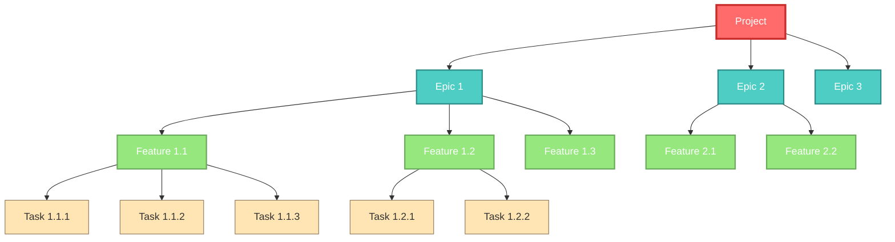
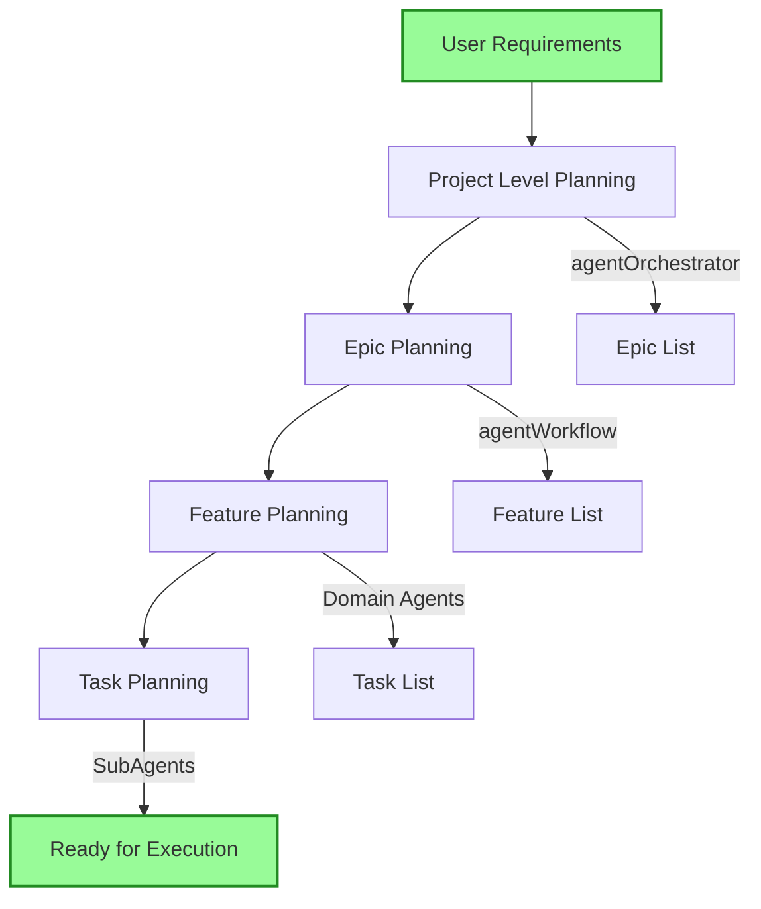

---
vault:
categories:
subCategories:
topics:
subTopics:
dateCreated: 2025-08-16
dateRevised: 2025-08-16
aliases: []
tags: []
---

# agents-project-hierarchy

## Overview

This document defines the hierarchical breakdown of projects into executable units and how agents coordinate to deliver complete solutions. The system follows a four-tier execution structure that maps directly to agent responsibilities and workflow patterns.

## Hierarchy Levels



## Hierarchy Definitions

### 1. Project Level

**Definition**: The complete deliverable system or application

**Characteristics**:
- Duration: Weeks to months
- Scope: Complete solution with multiple major components
- Ownership: agentOrchestrator + agentTaskManagement
- Deliverable: Fully functional system

**Agent Responsibilities**:
```yaml
project_level:
  primary_agent: agentOrchestrator
  supporting_agents:
    - agentTaskManagement: Overall tracking
    - agentWorkflow: Requirements analysis
    - agentEstimation: Project sizing
    - agentDesign: System architecture
  
  key_activities:
    - Requirements gathering
    - Architecture design
    - Resource allocation
    - Timeline establishment
    - Success criteria definition
```

**Example Projects**:
- E-commerce Platform
- Task Management System
- Analytics Dashboard
- Mobile Application
- API Gateway Service

### 2. Epic Level

**Definition**: Major functional area or significant milestone within a project

**Characteristics**:
- Duration: Days to weeks
- Scope: Complete feature set serving a specific user need
- Ownership: agentWorkflow + domain agents
- Deliverable: Working subsystem

**Agent Responsibilities**:
```yaml
epic_level:
  primary_agent: agentWorkflow
  supporting_agents:
    - agentDesign: Epic architecture
    - agentEstimation: Epic sizing
    - agentImplementation: Coordination
    - Domain agents: Specific expertise
  
  key_activities:
    - Epic planning
    - Feature breakdown
    - Dependency mapping
    - Integration planning
    - Testing strategy
```

**Example Epics**:
- User Authentication System
- Payment Processing
- Product Catalog
- Shopping Cart
- Order Management
- Reporting Dashboard

### 3. Feature Level

**Definition**: Specific functionality that delivers user value

**Characteristics**:
- Duration: Hours to days
- Scope: Complete user-facing capability
- Ownership: Domain agents (Backend, Frontend, etc.)
- Deliverable: Tested, integrated functionality

**Agent Responsibilities**:
```yaml
feature_level:
  primary_agents:
    - agentImplementation: Feature development
    - agentBackend: Server features
    - agentFrontend: UI features
  
  supporting_agents:
    - agentTest: Feature testing
    - agentSecurity: Security review
    - agentPerformance: Performance check
  
  key_activities:
    - Feature implementation
    - Unit testing
    - Integration testing
    - Code review
    - Documentation
```

**Example Features**:
- User Registration Form
- Login with OAuth
- Add to Cart Button
- Checkout Process
- Order History View
- Password Reset Flow

### 4. Task Level

**Definition**: Atomic unit of work that can be completed independently

**Characteristics**:
- Duration: Minutes to hours
- Scope: Single specific implementation
- Ownership: SubAgents via parent agents
- Deliverable: Code, configuration, or documentation

**Agent Responsibilities**:
```yaml
task_level:
  execution_agents:
    - Language SubAgents: Code writing
    - Domain SubAgents: Specialized work
  
  coordination:
    - Parent agent delegates
    - SubAgent executes
    - Parent validates
    - Results returned
  
  key_activities:
    - Code implementation
    - Configuration changes
    - Documentation updates
    - Test creation
    - Bug fixes
```

**Example Tasks**:
- Create user model
- Write validation function
- Add API endpoint
- Style login button
- Write unit test
- Update README
- Fix null pointer bug

## Execution Flow

### Top-Down Planning



### Bottom-Up Execution

```mermaid
graph BU
    T[Tasks Complete] --> F[Features Complete]
    F --> E[Epics Complete]
    E --> P[Project Complete]
    
    T -->|SubAgents| TC[Task Code]
    F -->|Domain Agents| FI[Feature Integration]
    E -->|agentWorkflow| EV[Epic Validation]
    P -->|agentOrchestrator| PD[Project Delivery]
    
    style T fill:#FFE5B4,stroke:#8B7355,stroke-width:1px
    style P fill:#98FB98,stroke:#228B22,stroke-width:2px
```

## Agent Assignment by Level

| Hierarchy Level | Primary Agents | Supporting Agents | Execution Agents |
|----------------|---------------|-------------------|------------------|
| **Project** | agentOrchestrator | agentTaskManagement, agentWorkflow, agentEstimation | None |
| **Epic** | agentWorkflow | agentDesign, agentEstimation | None |
| **Feature** | agentImplementation, agentBackend, agentFrontend | agentTest, agentSecurity, agentPerformance | None |
| **Task** | Domain Agents | None | Language SubAgents |

## Size Estimation Guidelines

### Project Sizing

```yaml
project_sizes:
  small:
    duration: 1-2 weeks
    epics: 2-3
    features: 5-10
    tasks: 20-50
    tokens: 5M-10M
    estimated_cost: $200-$500
    
  medium:
    duration: 2-4 weeks
    epics: 3-5
    features: 10-25
    tasks: 50-150
    tokens: 10M-50M
    estimated_cost: $500-$2000
    
  large:
    duration: 1-3 months
    epics: 5-10
    features: 25-75
    tasks: 150-500
    tokens: 50M-200M
    estimated_cost: $2000-$8000
    
  enterprise:
    duration: 3+ months
    epics: 10+
    features: 75+
    tasks: 500+
    tokens: 200M+
    estimated_cost: $8000+
```

### Epic Sizing

```yaml
epic_sizes:
  simple:
    duration: 1-3 days
    features: 2-3
    tasks: 5-15
    tokens: 1M-3M
    
  standard:
    duration: 3-5 days
    features: 3-5
    tasks: 15-30
    tokens: 3M-10M
    
  complex:
    duration: 1-2 weeks
    features: 5-10
    tasks: 30-75
    tokens: 10M-25M
```

### Feature Sizing

```yaml
feature_sizes:
  trivial:
    duration: 1-2 hours
    tasks: 1-3
    tokens: 50K-200K
    
  small:
    duration: 2-4 hours
    tasks: 3-5
    tokens: 200K-500K
    
  medium:
    duration: 4-8 hours
    tasks: 5-10
    tokens: 500K-1M
    
  large:
    duration: 1-2 days
    tasks: 10-20
    tokens: 1M-3M
```

### Task Sizing

```yaml
task_sizes:
  micro:
    duration: 5-15 minutes
    tokens: 5K-10K
    model: gemini-2.5-flash
    
  small:
    duration: 15-30 minutes
    tokens: 10K-50K
    model: gemini-2.5-flash
    
  medium:
    duration: 30-60 minutes
    tokens: 50K-200K
    model: o4-mini or gemini-2.5-pro
    
  large:
    duration: 1-2 hours
    tokens: 200K-500K
    model: o3 or gemini-2.5-pro
```

## Token Estimation by Hierarchy

### Project Token Estimation Formula

```python
def estimate_project_tokens(epics):
    """
    Estimate total tokens for a project
    """
    total = 0
    overhead = 0.2  # 20% overhead for coordination
    
    for epic in epics:
        epic_tokens = estimate_epic_tokens(epic)
        total += epic_tokens
    
    # Add overhead for orchestration
    total = total * (1 + overhead)
    
    # Add project-level activities
    project_overhead = {
        'planning': 500_000,
        'design': 1_000_000,
        'integration': 750_000,
        'testing': 1_000_000,
        'documentation': 500_000
    }
    
    total += sum(project_overhead.values())
    return total
```

### Epic Token Estimation

```yaml
epic_token_breakdown:
  planning_phase:
    requirements_analysis: 100K-200K
    design_review: 150K-300K
    task_breakdown: 50K-100K
    
  implementation_phase:
    feature_tokens: [sum of all features]
    integration: 200K-500K
    
  validation_phase:
    testing: 300K-600K
    review: 100K-200K
    
  total_formula: |
    epic_tokens = planning + implementation + validation
    epic_tokens *= 1.15  # 15% coordination overhead
```

### Feature Token Estimation

```yaml
feature_token_breakdown:
  development:
    backend_implementation: 100K-500K
    frontend_implementation: 100K-500K
    database_changes: 50K-200K
    
  quality:
    unit_tests: 50K-150K
    integration_tests: 75K-200K
    code_review: 25K-75K
    
  documentation:
    api_docs: 25K-50K
    user_docs: 25K-50K
    
  total_formula: |
    feature_tokens = development + quality + documentation
    feature_tokens *= 1.1  # 10% coordination overhead
```

## Parallel Execution Strategy

### Epic-Level Parallelization

```yaml
parallel_execution:
  independent_epics:
    - Can run simultaneously
    - Different agent teams
    - No shared dependencies
    example:
      - Epic: User Management (Team A)
      - Epic: Product Catalog (Team B)
      - Epic: Reporting (Team C)
    
  dependent_epics:
    - Sequential execution required
    - Shared resources or dependencies
    - Integration points
    example:
      - Epic: Authentication (must complete first)
      - Epic: User Profile (depends on auth)
      - Epic: Permissions (depends on both)
```

### Feature-Level Parallelization

```yaml
feature_parallelization:
  within_epic:
    backend_features:
      - API endpoints
      - Database schema
      - Business logic
      agents: [agentBackend + subAgents]
    
    frontend_features:
      - UI components
      - State management
      - Routing
      agents: [agentFrontend + subAgents]
    
    infrastructure_features:
      - Deployment setup
      - Monitoring
      - CI/CD
      agents: [agentInfrastructure + subAgents]
```

## Tracking and Reporting

### Progress Tracking Structure

```yaml
progress_tracking:
  project_level:
    metrics:
      - Epics completed / total
      - Overall percentage
      - Burn rate (tokens/day)
      - Cost tracking
    reporting_agent: agentTaskManagement
    
  epic_level:
    metrics:
      - Features completed / total
      - Story points completed
      - Velocity trending
      - Blockers identified
    reporting_agent: agentWorkflow
    
  feature_level:
    metrics:
      - Tasks completed / total
      - Code coverage
      - Tests passing
      - Performance metrics
    reporting_agent: Domain agents
    
  task_level:
    metrics:
      - Lines of code
      - Execution time
      - Token usage
      - Success/failure
    reporting_agent: SubAgents
```

### Status Report Format

```markdown
## Project Status Report

### Project: E-Commerce Platform
**Date**: 2025-08-16
**Overall Progress**: 45%

### Epic Status
| Epic | Progress | Features | Tasks | Status |
|------|----------|----------|-------|---------|
| User Management | 80% | 4/5 | 18/22 | On Track |
| Product Catalog | 60% | 3/5 | 12/20 | On Track |
| Shopping Cart | 30% | 2/6 | 6/24 | Behind |
| Payment | 0% | 0/4 | 0/16 | Not Started |

### Token Usage
| Model | Used | Estimated | % Used |
|-------|------|-----------|--------|
| o3 | 12M | 30M | 40% |
| gemini-2.5-pro | 8M | 20M | 40% |
| gemini-2.5-flash | 15M | 40M | 37.5% |

### Cost Tracking
- Spent to Date: $580
- Estimated Total: $1,450
- Budget Remaining: $870
- Burn Rate: $82/day

### Blockers
1. Payment gateway API documentation incomplete
2. Performance testing environment not ready
3. Waiting for security review on auth epic
```

## Workflow Integration

### How Hierarchy Maps to Agent Workflow

1. **Project Initiation**
   ```
   User → agentOrchestrator → agentWorkflow → agentEstimation
   ```

2. **Epic Planning**
   ```
   agentWorkflow → agentDesign → Domain Agents
   ```

3. **Feature Development**
   ```
   Domain Agents → Language SubAgents → Code Generation
   ```

4. **Task Execution**
   ```
   SubAgents → Actual Implementation → Parent Validation
   ```

5. **Integration & Validation**
   ```
   agentTest → agentSecurity → agentPerformance → agentOrchestrator
   ```

## Best Practices

### Planning Phase
1. **Always estimate tokens at project start**
2. **Break epics into independent units when possible**
3. **Identify dependencies early**
4. **Allocate 20-30% buffer for unexpected complexity**
5. **Plan for parallel execution opportunities**

### Execution Phase
1. **Complete tasks before marking features done**
2. **Validate at each hierarchy level**
3. **Track token usage against estimates**
4. **Escalate blockers immediately**
5. **Maintain progress visibility**

### Completion Phase
1. **Verify all tasks in feature are complete**
2. **Confirm integration tests pass**
3. **Update documentation**
4. **Record actual vs estimated metrics**
5. **Capture lessons learned**

## Example Project Breakdown

### Project: Task Management System

```yaml
project:
  name: Task Management System
  duration: 3 weeks
  estimated_tokens: 45M
  estimated_cost: $1,800
  
  epics:
    1_user_management:
      duration: 4 days
      features:
        - user_registration (8 tasks)
        - user_authentication (10 tasks)
        - user_profile (6 tasks)
        - password_recovery (5 tasks)
      estimated_tokens: 8M
      
    2_task_crud:
      duration: 5 days
      features:
        - create_task (7 tasks)
        - read_task (5 tasks)
        - update_task (6 tasks)
        - delete_task (4 tasks)
        - task_assignment (8 tasks)
      estimated_tokens: 10M
      
    3_project_management:
      duration: 3 days
      features:
        - create_project (6 tasks)
        - project_settings (5 tasks)
        - project_members (7 tasks)
      estimated_tokens: 6M
      
    4_notifications:
      duration: 2 days
      features:
        - email_notifications (6 tasks)
        - in_app_notifications (5 tasks)
        - notification_preferences (4 tasks)
      estimated_tokens: 5M
      
    5_reporting:
      duration: 3 days
      features:
        - task_analytics (8 tasks)
        - user_analytics (6 tasks)
        - project_reports (7 tasks)
        - export_functionality (5 tasks)
      estimated_tokens: 7M
      
    6_integration_testing:
      duration: 2 days
      features:
        - e2e_testing (10 tasks)
        - performance_testing (8 tasks)
        - security_audit (6 tasks)
      estimated_tokens: 5M
      
  overhead:
    orchestration: 2M
    documentation: 1M
    deployment: 1M
```

## Critical Success Factors

1. **Clear Hierarchy Definition**: Every work item must clearly belong to one level
2. **Proper Sizing**: Accurate estimation prevents budget overruns
3. **Dependency Management**: Identify and resolve dependencies early
4. **Progress Visibility**: Regular status updates at all levels
5. **Token Tracking**: Monitor actual vs estimated usage
6. **Parallel Execution**: Maximize throughput with parallel work
7. **Quality Gates**: Validate completion at each level
8. **Communication**: Clear handoffs between agents

## Monitoring Commands

```bash
# Project level monitoring
/sc:status --level project
/sc:progress --show-all

# Epic level monitoring
/sc:epic --status "User Management"
/sc:epic --list-features

# Feature level monitoring
/sc:feature --status "Login"
/sc:feature --show-tasks

# Task level monitoring
/sc:task --list-active
/sc:task --show-completed

# Token usage monitoring
/sc:tokens --by-epic
/sc:tokens --by-model
/sc:tokens --compare-estimate
```

---

*Document Version: 1.0.0*
*Last Updated: 2025-08-16*
*Status: Active*
*Note: Budget system is NOT currently implemented - this is a planning framework*
