---
vault:
categories:
subCategories:
topics:
subTopics:
dateCreated: 2025-08-14
dateRevised: 2025-08-16
aliases: []
tags: []
---

# agents-subagents-diagram-sysarch

## Complete Agent Network with All Relationships

```mermaid
graph TB
    %% User Interface
    User[👤 User] --> AO[🎯 agentOrchestrator]
    
    %% Orchestrator connections to all agents
    AO -.->|orchestrates| AA[🔍 agentAnalyzer]
    AO -.->|orchestrates| AB[⚙️ agentBackend]
    AO -.->|orchestrates| AF[🎨 agentFrontend]
    AO -.->|orchestrates| AS[🔒 agentSecurity]
    AO -.->|orchestrates| AT[🧪 agentTest]
    AO -.->|orchestrates| AP[⚡ agentPerformance]
    AO -.->|orchestrates| AD[📚 agentDocumentation]
    AO -.->|orchestrates| AI[🏗️ agentInfrastructure]
    AO -.->|orchestrates| AIm[💻 agentImplementation]
    AO -.->|orchestrates| ADe[🐛 agentDebug]
    AO -.->|orchestrates| AC[🧹 agentCleanup]
    AO -.->|orchestrates| AW[📋 agentWorkflow]
    AO -.->|orchestrates| ABu[🔨 agentBuilder]
    AO -.->|orchestrates| AG[📦 agentGit]
    AO -.->|orchestrates| ADes[🎯 agentDesign]
    AO -.->|orchestrates| AE[📊 agentEstimation]
    
    %% Language SubAgents
    subgraph "Language SubAgents"
        SANJ[Node.js]
        SAJS[JavaScript]
        SATS[TypeScript]
        SAGAS[Google Apps Script]
        SAG[Go]
        SAP[Python]
    end
    
    %% Code-writing agents to language subagents
    AB --> SANJ
    AB --> SAJS
    AB --> SATS
    AB --> SAGAS
    AB --> SAG
    AB --> SAP
    
    AF --> SAJS
    AF --> SATS
    AF --> SAGAS
    
    AIm --> SANJ
    AIm --> SAJS
    AIm --> SATS
    AIm --> SAGAS
    AIm --> SAG
    AIm --> SAP
    
    ADe --> SANJ
    ADe --> SAJS
    ADe --> SATS
    ADe --> SAGAS
    ADe --> SAG
    ADe --> SAP
    
    AC --> SANJ
    AC --> SAJS
    AC --> SATS
    AC --> SAGAS
    AC --> SAG
    AC --> SAP
    
    AT --> SANJ
    AT --> SAJS
    AT --> SATS
    AT --> SAG
    AT --> SAP
    
    ABu --> SAJS
    ABu --> SATS
    ABu --> SAP
    ABu --> SAG
    
    AI --> SAP
    AI --> SAG
    AI --> SAJS
    AI --> SATS
    
    %% Coordination relationships
    AB <--> AF
    AB <--> AS
    AF <--> AS
    AT <--> AP
    AIm <--> AB
    AIm <--> AF
    ADe <--> AA
    AW <--> AE
    
    %% All outputs lead to code
    SANJ --> Code[📄 Generated Code]
    SAJS --> Code
    SATS --> Code
    SAGAS --> Code
    SAG --> Code
    SAP --> Code
    
    %% Styling
    style User fill:#FFE5B4,stroke:#8B7355,stroke-width:2px
    style AO fill:#FF6B6B,stroke:#C92A2A,stroke-width:3px,color:#fff
    style Code fill:#90EE90,stroke:#228B22,stroke-width:3px
    style SANJ fill:#68D391,stroke:#2F855A,stroke-width:2px
    style SAJS fill:#F6E05E,stroke:#D69E2E,stroke-width:2px
    style SATS fill:#4299E1,stroke:#2B6CB0,stroke-width:2px
    style SAGAS fill:#9F7AEA,stroke:#6B46C1,stroke-width:2px
    style SAG fill:#48BB78,stroke:#276749,stroke-width:2px
    style SAP fill:#4299E1,stroke:#2C5282,stroke-width:2px
```



## Data Flow and Memory Access Patterns


## Communication Protocol Visualization


## Agent Hierarchy and Authority

```mermaid
graph TD
    %% Tier 1: Orchestrator
    subgraph "Tier 1: Command"
        AO[agentOrchestrator<br/>Full Authority]
    end
    
    %% Tier 2: Primary Agents
    subgraph "Tier 2: Execution"
        subgraph "Core Agents"
            AA[agentAnalyzer]
            AB[agentBackend]
            AF[agentFrontend]
            AS[agentSecurity]
            AT[agentTest]
            AP[agentPerformance]
            AD[agentDocumentation]
            AI[agentInfrastructure]
        end
        
        subgraph "Specialized Agents"
            AIm[agentImplementation]
            ADe[agentDebug]
            AC[agentCleanup]
            Others[...]
        end
    end
    
    %% Tier 3: SubAgents
    subgraph "Tier 3: Support"
        subgraph "Language SubAgents"
            LangSubs[Node.js | JS | TS | Python | Go | GAS]
        end
        
        subgraph "Domain SubAgents"
            DomainSubs[Database | API | Security | Testing | ...]
        end
    end
    
    %% Authority flow
    AO ==>|Commands| AA
    AO ==>|Commands| AB
    AO ==>|Commands| AF
    AO ==>|Commands| AIm
    
    AA -->|Delegates| DomainSubs
    AB -->|Delegates| LangSubs
    AF -->|Delegates| LangSubs
    AIm -->|Delegates| LangSubs
    
    %% Styling
    style AO fill:#FF6B6B,stroke:#C92A2A,stroke-width:4px,color:#fff
    style LangSubs fill:#90EE90,stroke:#228B22,stroke-width:2px
    style DomainSubs fill:#87CEEB,stroke:#4682B4,stroke-width:2px
```

## Task Execution Flow


## Model Selection Decision Tree


## Parallel Execution Pattern

```mermaid
graph TB
    subgraph "Orchestrator"
        O[agentOrchestrator]
    end
    
    subgraph "Parallel Execution Wave 1"
        O -->|async| Design[agentDesign]
        O -->|async| Context[agentContextLoader]
        O -->|async| Estimate[agentEstimation]
    end
    
    subgraph "Parallel Execution Wave 2"
        Design --> Backend[agentBackend]
        Design --> Frontend[agentFrontend]
        Context --> Implementation[agentImplementation]
    end
    
    subgraph "Language SubAgents (Parallel)"
        Backend --> NodeJS[subAgentNodeJS]
        Backend --> Python[subAgentPython]
        Frontend --> JavaScript[subAgentJavaScript]
        Frontend --> TypeScript[subAgentTypeScript]
        Implementation --> Go[subAgentGo]
    end
    
    subgraph "Convergence"
        NodeJS --> Integration[Integration Point]
        Python --> Integration
        JavaScript --> Integration
        TypeScript --> Integration
        Go --> Integration
    end
    
    Integration --> Test[agentTest]
    Test --> Complete[✓ Complete]
    
    style O fill:#FF6B6B,stroke:#C92A2A,stroke-width:3px,color:#fff
    style Complete fill:#90EE90,stroke:#228B22,stroke-width:2px
```



## Error Handling and Recovery Flow


## Complete Workflow Example: Feature Implementation


