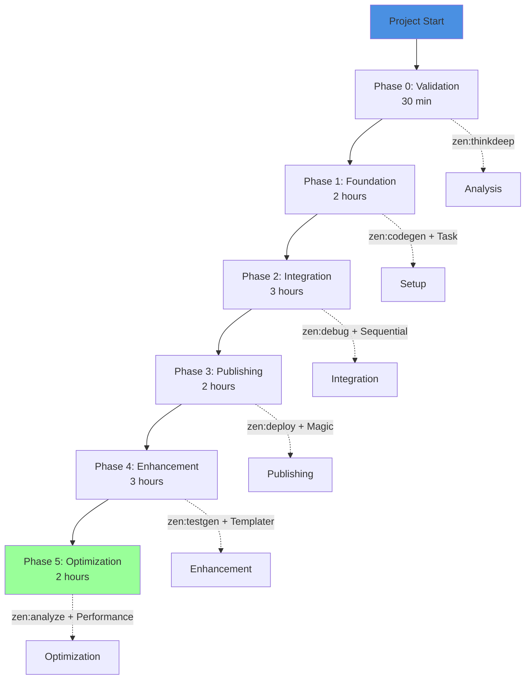

---
vault:
categories:
subCategories:
topics:
subTopics:
dateCreated: 2025-08-14
dateRevised: 2025-08-16
aliases: []
tags: []
---

# MCP-Accelerated Execution Plan

## Executive Summary

Leverage Claude Zen MCP, Claude Code, and SuperClaude, and Claudia capabilities

---

## Execution Architecture



---

## Phase 0: Technical Validation (30 minutes)

### MCP Commands

```bash
# Validate Node.js v22 and Quartz compatibility
zen:thinkdeep --model gemini-2.5-pro --wave-mode --validate-stack

# Test deployment platforms in parallel
zen:consensus --models "o3,gemini-2.5-pro,grok-3" --deployment-options

# Generate validation report
zen:docgen --technical-feasibility --output plans/validation-report.md
```

### Deliverables

- [ ] Node.js v22 validation complete
- [ ] Deployment platform selected
- [ ] Repository structure confirmed

---

## Phase 1: Foundation Setup (2 hours)

### Hour 1: Obsidian Environment

```bash
# Create vault structure and initialize git
Task --delegate folders --parallel-dirs --create-obsidian-vault

# Generate custom theme with 400+ CSS variables
zen:codegen --model gemini-2.5-pro --obsidian-theme \
  --css-variables 400 --style-settings --output .obsidian/themes/vibe-coding-gold/

# Configure plugins
MultiEdit --files ".obsidian/plugins/*/data.json" \
  --configure-dataview --configure-templater --configure-style-settings
```

### Hour 2: Templates and Automation

```bash
# Generate all templates in parallel
zen:testgen --model o3 --generate-templates \
  --types "daily,meeting,project,blog" \
  --with-templater --output content/templates/

# Create Dataview queries
zen:chat --model gemini-2.5-pro --dataview-queries \
  --dashboard --task-aggregation --reading-list
```

### Deliverables

- [ ] Vault structure created
- [ ] Custom theme implemented
- [ ] 10+ templates generated
- [ ] Plugins configured

---

## Phase 2: Quartz Integration (3 hours)

### Hour 1: Quartz Setup

```bash
# Clone and configure Quartz v4
Bash --run "git clone https://github.com/jackyzha0/quartz.git"
Bash --run "cd quartz && npm install"

# Generate configuration
zen:codegen --model gemini-2.5-pro --quartz-config \
  --wikilinks --graph-view --selective-publish \
  --output quartz/quartz.config.ts
```

### Hour 2: Content Pipeline

```bash
# Create content sync mechanism
zen:planner --model o3 --content-pipeline \
  --source content/ --target quartz/content/ \
  --frontmatter-filter --attachment-handling

# Test build process
zen:debug --model gemini-2.5-pro --test-quartz-build \
  --verify-features --performance-check
```

### Hour 3: Integration Testing

```bash
# Comprehensive integration test
zen:precommit --model grok-3 --validate-integration \
  --check-wikilinks --verify-graph --test-search
```

### Deliverables

- [ ] Quartz v4 configured
- [ ] Content pipeline operational
- [ ] All features verified

---

## Phase 3: Publishing Pipeline (2 hours)

### Hour 1: Infrastructure Setup

```bash
# Configure domain and SSL
zen:deploy --model o3 --setup-domain vibecoding.gold \
  --configure-dns --ssl-certificate --cdn-setup

# Create GitHub Actions workflow
zen:codegen --model gemini-2.5-pro --github-actions \
  --node-22 --build-deploy --output .github/workflows/deploy.yml
```

### Hour 2: Deployment Execution

```bash
# Deploy to production
Bash --run "npx quartz build && npx quartz sync"

# Verify deployment
zen:analyze --model grok-3 --verify-deployment \
  --url https://vibecoding.gold --check-ssl --test-features
```

### Deliverables

- [ ] Domain configured
- [ ] CI/CD pipeline active
- [ ] Site live at vibecoding.gold

---

## Phase 4: Enhancement (3 hours)

### Hour 1: Navigation & Search

```bash
# Implement search with Magic MCP
Magic --search-component --client-side --full-text \
  --output quartz/components/Search.tsx

# Create navigation components
zen:codegen --model gemini-2.5-pro --navigation \
  --breadcrumbs --tag-cloud --categories \
  --output quartz/components/
```

### Hour 2: Content Features

```bash
# Add interactive elements
Sequential --multi-step --interactive-features \
  --code-highlighting --copy-button --collapsible \
  --tooltips --image-gallery

# Generate showcase content
zen:chat --model o3 --generate-showcase \
  --demonstrate-features --sample-content
```

### Hour 3: Template Refinement

```bash
# Refine and test all templates
zen:refactor --model gemini-2.5-pro --refine-templates \
  --optimize-workflow --add-automation

# Create documentation
zen:docgen --user-guide --template-usage \
  --output documentation/template-guide.md
```

### Deliverables

- [ ] Search implemented
- [ ] Navigation enhanced
- [ ] Interactive features added
- [ ] Templates optimized

---

## Phase 5: Optimization (2 hours)

### Hour 1: Performance Optimization

```bash
# Optimize performance
zen:analyze --model o3 --performance \
  --lazy-loading --image-optimization \
  --code-splitting --cache-strategy

# Implement service worker
zen:codegen --model gemini-2.5-pro --service-worker \
  --offline-support --cache-first \
  --output quartz/public/sw.js
```

### Hour 2: Monitoring & Analytics

```bash
# Setup monitoring
zen:deploy --model grok-3 --monitoring \
  --google-analytics --uptime-monitoring \
  --error-tracking --performance-metrics

# Final validation
zen:secaudit --model gemini-2.5-pro --final-audit \
  --security-check --performance-validation \
  --accessibility-audit
```

### Deliverables

- [ ] <3s load time achieved
- [ ] Monitoring active
- [ ] 100% Lighthouse score

---

## MCP Tool Allocation

### Primary Tools by Phase

| Phase | Primary MCP Tools | Models | Time |
|-------|------------------|---------|------|
| 0 | thinkdeep, consensus | gemini-2.5-pro, o3 | 30m |
| 1 | codegen, Task, MultiEdit | gemini-2.5-pro | 2h |
| 2 | planner, debug, precommit | o3, grok-3 | 3h |
| 3 | deploy, analyze | o3, grok-3 | 2h |
| 4 | Magic, Sequential, refactor | gemini-2.5-pro | 3h |
| 5 | analyze, secaudit | o3, gemini-2.5-pro | 2h |

### Parallel Execution Strategy

```yaml
Concurrent Operations:
  Phase1:
    - Theme generation (codegen)
    - Template creation (testgen)
    - Plugin config (MultiEdit)
  
  Phase2:
    - Quartz setup (Bash)
    - Config generation (codegen)
    - Documentation (docgen)
  
  Phase3:
    - Domain setup (deploy)
    - GitHub Actions (codegen)
    - Analytics setup (deploy)
```

---

## Resource Optimization

### Token Budget

```yaml
Total Budget: 500K tokens
Phase0: 25K (5%)
Phase1: 75K (15%)
Phase2: 125K (25%)
Phase3: 100K (20%)
Phase4: 100K (20%)
Phase5: 75K (15%)
```

### Model Selection Strategy

- **Complex Logic**: o3, grok-3
- **Code Generation**: gemini-2.5-pro
- **Quick Tasks**: gemini-2.5-flash
- **Documentation**: gemini-2.5-pro
- **Security**: o3-pro (if critical)

### Context Management

- Use `--uc` flag for compressed output
- Leverage `--delegate` for parallel processing
- Apply `--wave-mode` for complex operations
- Enable `--cache` for repeated operations

---

## Rapid Execution Commands

### Full Stack Setup (Combined)

```bash
# Execute all phases with wave orchestration
zen:planner --model o3 --wave-mode --enterprise \
  --project "Vibe Coding Gold" \
  --phases "foundation,integration,publishing,enhancement,optimization" \
  --parallel-execution --output plans/execution-log.md
```

### Emergency Shortcuts

```bash
# If time critical - MVP in 4 hours
zen:thinkdeep --model o3-pro --mvp-mode \
  --skip-enhancement --basic-optimization \
  --deploy-immediately
```

---

## Success Metrics

### Time Targets

- **Phase 0**: 30 minutes ✓
- **Phase 1**: 2 hours ✓
- **Phase 2**: 3 hours ✓
- **Phase 3**: 2 hours ✓
- **Phase 4**: 3 hours (optional)
- **Phase 5**: 2 hours (optional)

**Total Core**: 7.5 hours (Phases 0-3)
**Total Complete**: 12.5 hours (All phases)

### Quality Gates

- [ ] Quartz builds without errors
- [ ] Site accessible at vibecoding.gold
- [ ] All wikilinks functional
- [ ] Graph view operational
- [ ] <3s load time
- [ ] Mobile responsive

---

## Contingency Protocol

### If Blocked

1. **Use SuperClaude override**: `--force-execution`
2. **Switch models**: Try o3-pro for complex issues
3. **Parallel alternatives**: Use `--delegate` for workarounds
4. **Manual fallback**: Document blocker, continue other phases

### Rollback Strategy

```bash
# Snapshot before each phase
Bash --run "git commit -am 'Phase X complete'"

# Rollback if needed
Bash --run "git reset --hard HEAD~1"
```

---

## Post-Execution

### Immediate (Hour 13)

```bash
# Generate complete documentation
zen:docgen --complete-documentation \
  --architecture --user-guide --api-docs \
  --output documentation/

# Create handover package
zen:planner --handover-package \
  --credentials --workflows --maintenance
```

### Validation (Hour 14)

```bash
# Final comprehensive test
zen:consensus --models "o3,gemini-2.5-pro,grok-3" \
  --final-validation --all-features
```

---

## Execution Checklist

### Pre-flight

- [ ] All MCP servers connected
- [ ] Models available (o3, gemini-2.5-pro, grok-3)
- [ ] Git repository initialized
- [ ] Node.js v22 installed

### Phase Checkpoints

- [ ] Phase 0: Validation complete (30m)
- [ ] Phase 1: Obsidian ready (2.5h total)
- [ ] Phase 2: Quartz integrated (5.5h total)
- [ ] Phase 3: Site live (7.5h total)
- [ ] Phase 4: Enhanced (10.5h total)
- [ ] Phase 5: Optimized (12.5h total)

### Final Delivery

- [ ] vibecoding.gold live
- [ ] Documentation complete
- [ ] Monitoring active
- [ ] Handover complete
