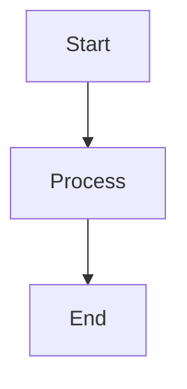

---
# Publishing Control
publish: false

# Content Metadata
title: "{{title}}"
dateCreated: {{date:YYYY-MM-DD}}
dateRevised: {{date:YYYY-MM-DD}}

# Hierarchical Organization
categories: ["Concepts"]
subCategories: [] # Architecture | Patterns | Theory | Best Practices
topics: []
subTopics: []

# Discovery & Navigation
tags: ["concept", "theory"]
aliases: []

# Concept-Specific Metadata
complexity: "intermediate" # basic | intermediate | advanced
domain: "" # frontend | backend | devops | security | architecture
relatedConcepts: []
---

# {{title}}

## Definition

> **{{title}}** is...

## Why It Matters

This concept is important because:
- 
- 
- 

## Core Principles

### Principle 1: 

**Explanation**: 

**Example**: 

### Principle 2: 

**Explanation**: 

**Example**: 

## How It Works

### Overview

### Detailed Explanation

1. **Step/Component 1**
   - 
   
2. **Step/Component 2**
   - 

### Visual Representation

## Real-World Applications

### Application 1: 

**Context**: 

**Implementation**: 

### Application 2: 

**Context**: 

**Implementation**: 

## Common Misconceptions

### Misconception: 
**Reality**: 

### Misconception: 
**Reality**: 

## Comparison with Related Concepts

| Aspect | {{title}} | Alternative |
|--------|-----------|-------------|
|  |  |  |

## Best Practices

1. **Practice**: 
   - Rationale: 

2. **Practice**: 
   - Rationale: 

## Further Reading

- 
- 

## Related Concepts

- [[related-concept-1]]
- [[related-concept-2]]

---
*Concept documentation - {{date:YYYY-MM-DD}}*